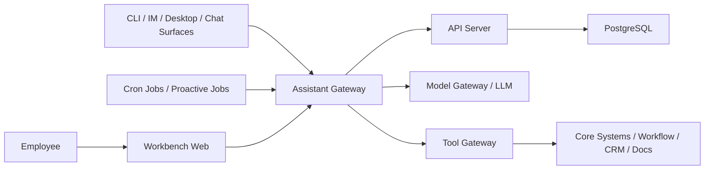
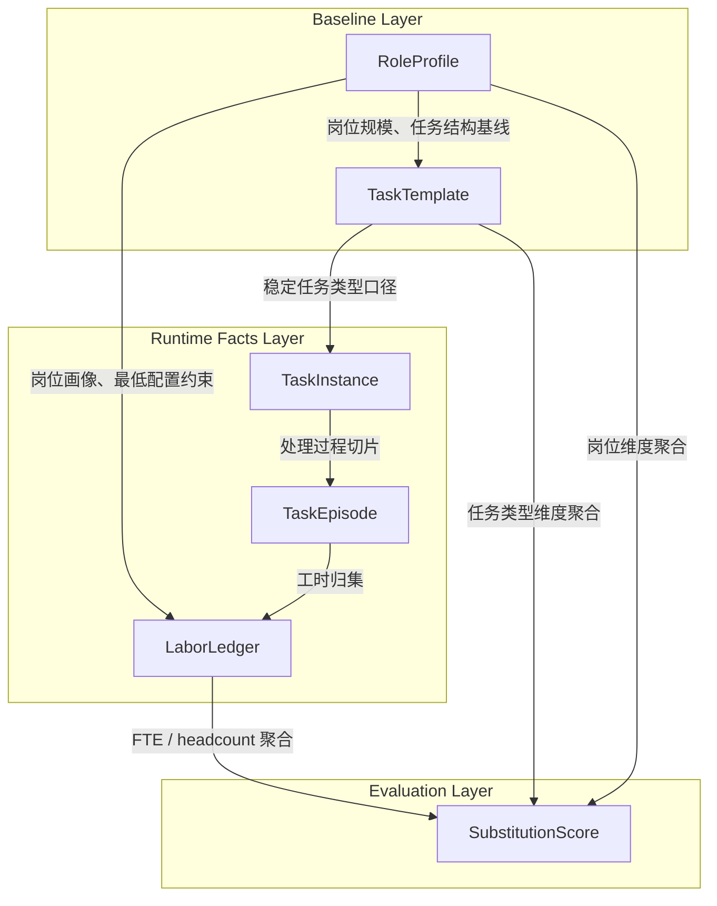
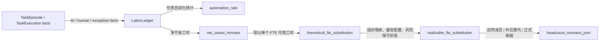

# Banking OpenClaw 架构 MVP（代码框架版）

## 1. 文档目标

这份文档不是描述长期终局架构，而是给出一个**方便快速搭建代码框架**的 MVP 工程版本。

目标是让团队可以尽快开始：

- 初始化仓库结构
- 拆出最小服务边界
- 定义核心对象模型
- 约定第一批 API
- 按可运行闭环推进开发

一句话定义：

**先用一个可演进的“轻量多进程 + 模块化单体”架构，打通 `Session -> Planning Interpretation -> Task Materialization -> Plan Commit -> Execution Agent -> Tool Gateway -> Audit` 最短闭环，并补上 `Cron Job -> Proactive Task` 的轻量主动链路。**

### 1.1 这份文档和其他文档的关系

这份文档的目标是指导 **MVP 代码框架搭建**，所以它是实现侧的一号参考文档。

其他相关文档在本文件中的作用只保留两类：

- `PRD MVP` 用来校验 MVP 范围和验收边界
- `technical architecture / PRD draft` 用来校验长期目标和阶段口径

如果不同文档之间存在表述差异，本文件优先保证：

- 核心运行时主线可以真实实现
- 对象边界、状态归属和 API 口径可以直接指导建模
- 终局能力不会反向污染 MVP 首版实现

### 1.2 `docs/mvp/` 专题索引

为避免主文档持续膨胀，部分 MVP 专题说明拆到 `docs/mvp/` 目录单独维护。

- `docs/mvp/assistant-self-learning-and-agents-md.md`
  - assistant 自我学习与成长机制
  - 银行版 `AGENTS.md` 的定位、成长闭环和最小模板
- `docs/mvp/engineering-coding-best-practices.md`
  - 当前 MVP 架构下的 engineering / coding best practices
  - 按前端、后端、运行时、数据库、工具网关、测试等目的分节
- `docs/mvp/frontend-engineering-checklist.md`
  - `apps/web` 的前端实现 checklist
  - 包含页面拆分、状态管理、路由组织与文件行数约束
- `docs/mvp/backend-runtime-engineering-checklist.md`
  - 后端、运行时与工具网关 checklist
  - 包含对象边界、runtime adapter、审计与文件行数约束
- `docs/mvp/database-engineering-checklist.md`
  - 数据库建模、migration、索引与历史保留 checklist
- `docs/mvp/testing-quality-checklist.md`
  - 测试分层、mock 策略、关键闭环与质量门槛 checklist

---

## 2. MVP 架构原则

为了让首版代码框架尽快落地，建议明确六条原则：

### 2.1 不做过早微服务化

MVP 阶段不建议一开始就把每个领域拆成独立微服务。  
推荐做成：

- 前端一个应用
- 本地 `Assistant Gateway` 一个应用
- 后端 `API` 一个应用
- `Tool Gateway` 一个独立服务

也就是：

**代码上按领域模块化，运行上只拆最少的进程数。**

其中，`Worker` / `Agent Runtime` 建议直接嵌入 `Assistant Gateway` 内部实现，和 OpenClaw 的 embedded agent runtime 保持一致；  
但在代码组织上，仍建议把它作为独立模块维护，方便后续再拆。

### 2.2 `Session` 和 `Task` 是一等对象

首版数据模型不要只围绕“消息”设计。  
即使 MVP 还只是 `Plan`，也必须从第一天就把：

- `Session`
- `Task`
- `TaskTemplate`
- `Plan`
- `TaskExecution`

建成正式对象。

这里需要特别澄清：

- 本文里的 `Task` 指的是 **business 意义上的工作语义对象**
- 它不是底层技术执行单元，也不是一次 SDK run

更准确地说：

**`Task` = 员工围绕某个业务对象，为了推进某项工作，而执行的一组工作动作的最小 AI 管理单元。**

如果进入正式持久化建模，下文默认用 `TaskInstance` 表示 `Task` 的持久化实体名；叙述层继续简称 `Task`。

例如在银行场景里，`Task` 更像：

- `材料完整性检查`
- `风险点摘要`
- `补件清单生成`
- `审查意见草稿`

而不是：

- 一次模型调用
- 一次 tool invocation
- 一个流程节点
- 一个按钮点击动作

在这套 MVP 架构里，建议明确分层如下：

- `Task`：业务工作对象，回答“当前要推进的是什么工作”
- `Plan`：当前这次准备怎么做
- `TaskExecution`：当前这次实际跑了一次什么执行
- `ToolCall`：某一步具体调用了什么工具
- `ProactiveJob`：某个主动任务在什么条件下被调度和执行

也就是说：

**`Task` 承载业务主线，`Plan / TaskExecution / ToolCall / ProactiveJob` 承载技术执行过程。**

### 2.3 `Plan Agent / Execution Agent` 先轻量实现

MVP 不做复杂任务图运行时，但也不要把执行逻辑散落在前端按钮和 if/else 里。  
建议在统一 `Agent Runtime` 之上先定义两个逻辑 LLM 角色：

- `Plan Agent`
- `Execution Agent`

这里先固定一个命名边界：

- `Agent Runtime` 是底层运行时承载层
- `Plan Agent` 负责 planning 阶段
- `Execution Agent` 负责 execution 阶段
- 本文不再把 `Coordinator` 作为独立正式术语使用

其中，`Execution Agent` 负责：

- 读取当前 `Plan`，并由 LLM 自己决定下一步
- 调用知识检索、技能和工具
- 记录执行结果
- 在失败或新材料进入时触发简化重规划

这里要特别强调：

- `Plan` 不是给硬编码工作流引擎消费的 DAG 脚本
- 它首先是给用户看、给系统审计、也给 LLM 回读的执行草图
- 真正的执行推进，仍由 LLM 基于当前 `Plan`、上下文、已有结果和工具反馈来判断

同时，`Plan Agent` 负责：

- 理解当前 `Session` 输入
- 生成 `Planning Interpretation`
- 识别 `taskCandidates`
- 生成 `draftPlan`
- 在需要时重新形成 replan 输入

### 2.4 `Tool Gateway` 必须第一天独立

无论其他后端模块是否先合并部署，`Tool Gateway` 都建议从第一天独立出来。  
因为它是最明确的安全边界，负责：

- 工具鉴权
- 动作分级
- 审计记录
- 幂等控制
- 业务系统连接

这里需要先把 `tool` 分成两层理解：

- `base runtime tools`：参考 OpenClaw / 通用 agent runtime 的基础环境能力，例如本地文件读写、shell、URL 读取、通用 MCP 调用
- `enterprise extension tools`：通过 CLI、MCP、内部 API 等方式接入银行内部系统的扩展能力

首版架构里不建议把所有 tool 都机械地塞进一个“业务工具”篮子里。  
更合适的方式是：

- 基础环境能力优先由 `Agent Runtime` 内置实现，`Assistant Gateway` 作为宿主和暴露入口承接调用
- 涉及企业系统、正式动作和统一凭证治理的能力，再通过 `Tool Gateway` 暴露

换句话说：

- `Tool Gateway` 更偏向企业系统接入和风险边界
- 它不是所有本地 host tool 的唯一承载位置

### 2.5 权威状态优先放数据库，不放内存

MVP 可以允许应用内缓存，但不能把权威状态仅放在进程内存里。  
最少要保证以下对象可持久化：

- `Session`
- `Task`
- `Plan`
- `TaskExecution`
- `ToolCall`
- `AuditEvent`

### 2.6 `Cron Job / 主动任务` 进入 MVP 主框架

MVP 不应只覆盖被动响应链路，还应从第一天把轻量 `cron job / proactive job` 放进代码框架。

首版不需要复杂主动编排，但至少要支持：

- 定时扫描待处理 `Task`
- 生成提醒、建议或候选后续动作
- 把主动结果重新挂回 `Session` / `Task`
- 保留 job 定义、执行记录和结果轨迹

这里建议把实现口径也一次写清楚：

- `ProactiveJob` 是权威业务定义，保存在 `API Server`
- `Cron Scheduler` 负责判断哪些 job 到期应执行
- 首版不强依赖独立消息队列，先用简单定时扫描和手动触发跑通主动任务闭环
- 主动任务执行结果仍通过 `API Server` 回写，不再额外引入第二套权威调度对象

---

## 3. 推荐 MVP 拓扑

推荐先落成 `4` 个运行单元：

1. `Workbench Web`
2. `Assistant Gateway`
3. `API Server`
4. `Tool Gateway`

再配 `1` 个核心基础设施：

1. `PostgreSQL`



### 3.1 与 OpenClaw 的总览对应关系

为了方便工程实现时对照 OpenClaw，可以先用下面这张表理解 MVP 框架和 OpenClaw 架构的映射关系。

| MVP 运行单元 / 模块 | 对应的 OpenClaw 架构 | 在银行版里的改造 |
| --- | --- | --- |
| `Workbench Web` | OpenClaw 的 Web / Desktop 前端触点 | 从通用前端触点改成银行工作台和 `Session Workspace` |
| `Assistant Gateway` | `Gateway` 控制平面 + WebSocket 协议层 + session 入口 + embedded agent runtime + cron | 作为本地控制面承接 Web、CLI、IM、Desktop、实时流式交互、内嵌执行运行时和轻量主动任务调度 |
| `API Server` | OpenClaw 中未显式拆出的后端对象服务 | 银行版把 `Session`、`Task`、模板、审批、审计查询和持久化显式下沉为远程服务 |
| `Tool Gateway` | tool policy / exec approvals / sandbox 边界 | 从个人信任模型升级为企业工具网关、审计、幂等和正式系统桥接 |
| `PostgreSQL` | session / cron / state 的显式持久化思路 | 从本地文件式状态升级为企业数据库中的 `Session / Task / Plan / Audit` 权威存储 |

如果一句话概括：

- `Assistant Gateway` 才是最接近 OpenClaw 的 `Gateway`
- `Assistant Gateway` 内部应嵌入 `Worker / Agent Runtime`，这一点也应和 OpenClaw 保持一致
- `Workbench Web` 对应的是 OpenClaw `Gateway` 所连接的前端触点，而不是 `Gateway` 本身
- `API Server` 更像银行版新增的远程对象服务层
- `Tool Gateway` 最接近 OpenClaw 的 tool policy / approval / sandbox 边界
- 银行版新增的核心是 `Task`、`Plan`、审批治理、企业系统桥接和治理化主动任务

---

## 4. 每个运行单元做什么

## 4.1 `Workbench Web`

职责只保留四类：

- `Session Workspace` 展示
- `Task` / `Plan` 展示
- 流式结果展示
- 人工确认、审批、继续执行、回退

不要在前端放：

- 任务识别规则
- 计划生成逻辑
- 工具编排逻辑
- 权威状态机

前端更像一个工作控制台，而不是执行引擎。

### 4.1.1 MVP 最小产品页面

如果从产品能跑起来的角度看，`Workbench Web` 不应只被理解成一个聊天界面。  
更合理的 MVP 形态是：**一个前台工作台 + 一组最小后台管理页面**，但仍共用同一个 `apps/web` 前端应用。

建议首版最少包含下面 `6` 类页面：

1. **`Session Workspace`**
   - 员工自然语言输入入口
   - 展示会话流、当前 `Task`、当前 `Plan`
   - 支持继续执行、暂停、人工接管

2. **`Task / Plan Review Panel`**
   - 查看 `taskCandidates`
   - 确认 `Task Materialization`
   - 提交 / 驳回 / 重提 `Plan`

3. **`Execution Monitor`**
   - 查看当前 step、工具调用结果、执行摘要
   - 查看人工确认点和异常暂停点
   - 面向一线员工和运营人员排查执行过程

4. **`Role / TaskTemplate Registry Admin`**
   - 维护目标岗位画像
   - 维护 `TaskTemplate / TaskType` 种子库
   - 配置适用岗位、风险等级、输入输出 schema、启用状态

5. **`Labor Ledger Review`**
   - 查看任务 episode、AI 执行片段、人工复核片段
   - 查看净节省工时的基础记录
   - 用于校对劳动记账口径，而不是只看运行日志

6. **`Substitution Dashboard`**
   - 查看任务类型维度和岗位维度的替代指标
   - 最少展示：
     - 自动化率
     - 净节省工时
     - 理论 FTE 替代
     - 可实现 FTE 替代
   - 面向产品、运营和管理层做阶段性评估

这 `6` 个页面里，前 `3` 个更偏一线工作台，后 `3` 个更偏后台管理与评估。  
但在 MVP 阶段，不建议单独再拆一个新的 admin 前端工程，直接在 `Workbench Web` 中通过不同路由承载即可。

### 对应 OpenClaw

- 对应的是 OpenClaw `Gateway` 所连接的 Web / Desktop 前端触点
- 它不是 OpenClaw 的 `Gateway` 本身
- 银行版把这层从“通用聊天前端”改造成“工作台 + `Session Workspace`”
- 它只负责承接交互，不承载真正的 agent loop

## 4.2 `Assistant Gateway`

这是 MVP 里严格对应 OpenClaw `Gateway` 的本地控制面。  
它建议运行在靠近用户触点的一侧，负责承接：

- `Workbench Web`
- `CLI`
- `Desktop App`
- 企业 IM / 聊天软件适配
- 实时流式事件
- 内嵌 `Worker / Agent Runtime`
- 内嵌 `Cron Job / Proactive Job Scheduler`

建议它承担的能力：

- 建立和维护实时连接
- 统一接入 `Session` 生命周期
- 承接流式输出和中断控制
- 在本地运行内嵌 `Plan Agent / Execution Agent / Skills`
- 在本地运行轻量 `Cron / Proactive Jobs`
- 调用 `Tool Gateway` 和统一 `Model Gateway`
- 把 `Session / Task / Plan / TaskExecution / ToolCall / AuditEvent / ProactiveJob` 的持久化请求统一路由给 `API Server`
- 管理本地短期运行态和连接态

这里建议明确一条硬边界：

- `Assistant Gateway` 负责 **控制面、运行时编排和实时交互**
- `API Server` 负责 **正式对象持久化和权威查询**
- `Assistant Gateway` 可以持有短期运行态缓存，但不应直接成为正式业务对象的权威写库方

### 对应 OpenClaw

- 这层才是最接近 OpenClaw `Gateway` 的部分
- 对应 OpenClaw 的 Gateway 控制平面、WebSocket 协议骨架、session 入口、embedded agent runtime 和 `Cron / Heartbeat`
- 银行版把它从个人 local-first agent shell，改造成面向企业工作台和多触点的本地控制面

## 4.3 `API Server`

这是 MVP 的主后端，建议先合并以下模块：

- `Session API`
- `Task API`
- `Session Router`
- `Role / TaskTemplate Registry`
- `Planning Interpretation API`
- `Task Materialization API`
- `Plan Commit / Approval API`
- `Execution Query API`
- `Labor Accounting API`
- `Substitution Analytics API`
- `Approval API`
- `Proactive Job API`
- `Audit Query API`

建议它承担的能力：

- 创建 / 续接 `Session`
- 写入消息
- 管理岗位画像、岗位规模口径和任务模板种子库
- 保存 planning 阶段产生的 `draftPlan`、task candidates 和 materialization 决策
- 根据 planning 结果新建或挂接 `TaskInstance`
- 提交正式 `Plan` 版本并记录审批结果
- 接收来自 `Assistant Gateway` 的执行事实写回请求
- 保存任务 episode、人工接管、复核和工时记账结果
- 计算并查询任务、岗位和部门维度的替代指标
- 记录计划审批结果
- 查询和管理主动任务定义、执行记录和结果
- 查询执行轨迹、任务状态和交付结果

这里也建议固定一条实现约束：

- 在 MVP 中，`API Server` 是 `Session / TaskInstance / Plan / TaskExecution / ToolCall / AuditEvent / ProactiveJob` 的单一权威写入入口
- `RoleProfile / TaskTemplate / TaskEpisode / LaborLedger / SubstitutionScore` 这类产品测绘与评估对象，同样应由 `API Server` 统一持久化和查询
- `Assistant Gateway` 可以发起 planning、execution 和 proactive run，但正式落库应通过 `API Server`
- 这样后续即使拆分独立执行存储服务，也不会破坏当前对象边界

### 对应 OpenClaw

- 它不直接对应 OpenClaw 的 `Gateway`
- 更像是银行版在 OpenClaw 基础上额外显式拆出的远程对象服务层
- 会承接 OpenClaw `Session / Queue` 思想在企业后端的持久化和治理化落地
- 银行版在这里额外增加了 `RoleProfile`、`Task`、`TaskTemplate`、劳动记账、替代评估、审批和审计查询等企业工作对象

## 4.4 `Embedded Runtime in Assistant Gateway`

虽然运行态上不再单独部署 `Worker`，但代码上仍建议保留一个内嵌运行时模块，先放入：

首版实现建议：

- 当前 `Agent Runtime` 先基于 `opencode SDK` 实现
- `Assistant Gateway` 通过统一的 runtime adapter 调用它，而不是把 SDK 细节散落到业务逻辑里
- 未来允许在同一抽象层下切换或并行支持其他 `Agent Runtime`

也就是说，MVP 现在选择的是：

**`opencode SDK` 作为首版 runtime provider，而不是把 `opencode` 写死成唯一长期底座。**

- `Plan Agent`
- `Execution Agent`
- `RAG / Knowledge Retrieval`
- 技能执行模块
- 简化版主动任务扫描器
- `Cron Scheduler`
- `TaskExecution / ToolCall / AuditEvent` 写回模块

这里建议把角色关系写死：

- `Plan Agent` 和 `Execution Agent` 都运行在统一 `Agent Runtime` 之上
- 它们是两个逻辑角色，不默认意味着两个独立部署进程
- `Plan Agent` 负责 `Planning Interpretation / draftPlan`
- `Execution Agent` 负责在正式 `Plan` 生效后推进执行
- `Task Materialization` 和 `Plan Commit` 仍属于系统/API 层对象操作，不由 agent 直接落权威状态

它负责：

- 生成 `Planning Interpretation` 和 `draftPlan`
- 在 `Task` materialize 且 `Plan` commit 后，重新读取当前有效 `Plan` 并由 LLM 自己推进低风险步骤
- 调用工具前做上下文装配
- 把中间结果、失败原因、最终结果通过 `API Server` 写回正式对象
- 在需要时触发一次简化 `Replan`
- 定时扫描任务、会话和业务对象，生成提醒、建议和候选动作

在实现边界上，建议再补一条约束：

- 业务编排层只依赖统一的 `RuntimeAdapter` / `AgentRuntimeProvider` 接口
- `opencode SDK` 负责承接首版 agent loop、tool use、streaming 和运行态控制
- `Plan`、`Task`、审批、`TaskExecution` 和主动任务逻辑不应直接耦合到某个特定 SDK
- 系统不负责把 `Plan` 翻译成硬编码执行图，而是负责把 `Plan`、工具结果和治理约束回喂给 LLM

MVP 不要求它成为通用 DAG 引擎，只需要能稳定跑通：

- 单任务
- `1-3` 个顺序步骤
- 少量人工确认节点
- 少量固定规则的 `cron jobs`

### 对应 OpenClaw

- 最接近 OpenClaw 的 embedded `Agent Runtime / Agent Loop`
- 当前实现路径上，`opencode SDK` 承接这一层 runtime 能力
- `RAG / Knowledge Retrieval` 对应 OpenClaw 的 `Memory` 检索思路
- 技能执行模块对应 OpenClaw 的 `Skills`
- 简化版主动任务扫描器对应 OpenClaw 的 `Cron / Heartbeat`
- `Cron Scheduler` 对应 OpenClaw 的 `Cron / Heartbeat` 主动运行层
- 银行版把这层进一步改造成围绕 `Task` 和 `Plan` 的执行单元，并嵌入 `Assistant Gateway`
- 后续如果切换到底层 runtime，实现上应只替换 provider / adapter，而不重写上层任务框架

一句话总结这层的实现语义：

**`Plan Agent` 先生成 `Planning Interpretation / draftPlan`，系统完成 `Task Materialization + Plan Commit`，随后 `Execution Agent` 再读取该 `Plan` 并推进执行；系统只负责持久化、工具调用、审批治理和执行记录。**

### 4.4.1 执行契约设计关键点

如果要让“LLM 生成 Plan，LLM 再读取 Plan 执行”真正落地，首版实现里最关键的不是再发明一个运行时名词，而是把执行契约收紧。

这里建议先固定三个设计原则：

1. `Plan` 必须是 **LLM 可回读、可解释、可继续推进** 的文档对象
2. `RuntimeAdapter` 必须屏蔽底层 SDK 差异，只暴露上层真正关心的执行动作
3. 每次执行都必须把“计划 + 当前进度 + 工具结果 + 治理约束”一起回喂给 LLM，而不是只喂一段用户消息

#### A. `RuntimeAdapter` 不应暴露 SDK 细节

首版真正需要的不是一个“万能 runtime SDK 接口”，而是一个刚好支撑当前架构的执行接口。

建议最小接口形态如下：

```ts
interface RuntimeAdapter {
  interpretSession(input: PlanningInput): Promise<PlanningInterpretation>;
  startExecution(input: ExecutionStartInput): Promise<ExecutionStartResult>;
  continueExecution(input: ExecutionContinueInput): Promise<ExecutionStepResult>;
  runProactiveJob(input: ProactiveJobRunInput): Promise<ProactiveJobResult>;
  cancelExecution(input: ExecutionCancelInput): Promise<void>;
}
```

这里的关键点不是方法名，而是边界：

- `interpretSession` 只负责产出 planning 解释、task candidates 和 `draftPlan`
- `startExecution` / `continueExecution` 负责让 LLM 在当前上下文下决定下一步
- `runProactiveJob` 负责主动任务场景，不要和普通任务执行混成一个超大入口
- `cancelExecution` 只负责运行态取消，不承担业务状态回滚
- `Task Materialization` 和 `Plan Commit` 属于对象层操作，应由 `API Server` 负责持久化，不属于 runtime adapter 本身

不要把下面这些能力直接暴露给上层：

- SDK 原生 message 对象
- SDK 自带 run state 枚举
- SDK 特定的 tool call 事件格式
- SDK 私有 callback / hook 机制

否则未来从 `opencode SDK` 切到别的 runtime 时，`gateway-runtime` 上层会整层被拖着改。

#### B. `Plan Agent / Execution Agent` 的输入输出契约应分开固定

如果已经把运行角色收敛成 `Plan Agent` 和 `Execution Agent`，那它们的输入输出契约也不应混成一套模糊的 agent result。

更稳的方式是：

- `Plan Agent` 只负责理解输入并形成 planning 结果
- `Execution Agent` 只负责基于正式 `Plan` 推进下一步执行
- `Task Materialization`、`Plan Commit`、审批落库和审计写入仍由系统层负责

建议先固定最小契约如下：

```ts
type PlanAgentInput = {
  sessionId: string;
  latestMessages: Array<{ role: string; content: string }>;
  sessionSummary?: string;
  existingTasks: Array<{
    taskId: string;
    taskType: string;
    status: string;
  }>;
  businessContext?: Record<string, unknown>;
};

type PlanAgentResult = PlanningInterpretation;

type ExecutionAgentInput = {
  taskId: string;
  planId: string;
  context: ExecutionContextEnvelope;
};

type ExecutionAgentResult = {
  decisionType:
    | "call_tool"
    | "complete_step"
    | "pause_for_approval"
    | "request_replan"
    | "finish_execution";
  currentStepId?: string;
  decisionSummary: string;
  toolRequest?: {
    toolName: string;
    payload: Record<string, unknown>;
  };
  deliveryPatch?: Record<string, unknown>;
  replanReason?: string;
};
```

这里最关键的边界有四条：

- `PlanAgentResult` 只输出解释、候选任务和 `draftPlan`，不直接产出正式 `Task` 或已提交 `Plan`
- `ExecutionAgentResult` 只输出“下一步应该怎么推进”的决策，不直接写业务主对象
- `toolRequest` 是受控调用意图，真正调用外部系统仍要经过 `Tool Gateway`
- `request_replan` 是回到 planning 阶段的信号，不等于 agent 自己覆盖旧 `Plan`

这样设计的好处是：

- prompt 可以明确分成 `plan-agent` 和 `execution-agent`
- API / DTO 可以和 agent 角色一一对应
- 后续即使更换底层 runtime，也不需要重写上层对象语义

#### C. 每次喂给 LLM 的上下文包必须固定结构

执行时最容易犯的错，是只把：

- 用户最新一句话
- 或某个 step 文本

发给 LLM。

这样 LLM 实际上拿不到“自己之前生成的计划”和“当前执行事实”，执行会越来越漂。

建议每次执行都构造一个明确的 `ExecutionContextEnvelope`，最小包含：

```ts
type ExecutionContextEnvelope = {
  session: {
    id: string;
    summary: string;
    latestMessages: Array<{ role: string; content: string }>;
  };
  task: {
    id: string;
    name: string;
    businessObjectType: string;
    businessObjectId: string;
    status: string;
  };
  plan: {
    id: string;
    version: number;
    goal: string;
    steps: PlanStep[];
    deliverySchema: Record<string, unknown>;
    approvalStatus: string;
  };
  execution: {
    executionId: string;
    currentStepId?: string;
    completedStepIds: string[];
    waitingStepIds: string[];
    latestToolResults: ToolResultSnapshot[];
    latestFailures: FailureSnapshot[];
  };
  governance: {
    allowedTools: string[];
    blockedActions: string[];
    requiresApprovalForStepIds: string[];
    maxAutonomousSteps: number;
  };
};
```

这里最重要的设计关键点有四个：

- `plan.version` 必须明确，不然 LLM 不知道自己在执行哪个版本
- `completedStepIds / waitingStepIds` 必须显式给出，不要让 LLM 自己从长文本推断进度
- `latestToolResults` 必须结构化，而不是只塞原始日志
- `governance` 必须和计划一起回喂，否则 LLM 容易越过审批边界

#### D. `Plan.steps_json` 不能设计成给机器工作流引擎消费的 DAG

如果你把 `steps_json` 设计成一套过于技术化的状态图，比如：

- 节点类型枚举过多
- 分支条件写成 engine DSL
- retry / compensation / timeout 都写死在 plan 里

那它就会天然把系统推回“传统编排引擎”方向。

首版更合适的 `steps_json` 应该是 **LLM 可解释的结构化步骤说明**，建议每个 step 至少有：

```ts
type PlanStep = {
  stepId: string;
  title: string;
  purpose: string;
  status: "pending" | "in_progress" | "done" | "blocked";
  dependsOn?: string[];
  suggestedTools?: string[];
  requiredInputs?: string[];
  outputExpectation?: string;
  requiresHumanApproval?: boolean;
  approvalHint?: string;
};
```

这里的核心不是字段多少，而是字段语义：

- `title` 和 `purpose` 是给 LLM 回读理解的，不只是给前端展示
- `suggestedTools` 是建议，不是硬绑定
- `dependsOn` 只保留轻量依赖，不在 MVP 做复杂分支图
- `requiresHumanApproval` 是治理信号，不是执行引擎指令

换句话说，`PlanStep` 应该更像：

- “给 LLM 和人共同阅读的结构化执行说明”

而不是：

- “给 DAG runtime 逐节点执行的脚本”

#### E. `TaskExecution` 应记录“事实”，不记录“解释权”

首版执行表最容易做错的点，是把它设计成“驱动执行的真相来源”。

更稳的方式是：

- `Plan` 保存当前计划版本
- `TaskExecution` 保存这次执行事实
- 真正的下一步解释权仍然在 LLM

所以 `TaskExecution` 里最值得新增的不是复杂状态机，而是事实快照字段，例如：

- `plan_snapshot_json`
- `context_envelope_json`
- `last_llm_decision_summary`
- `last_tool_result_summary`
- `handoff_reason`

这些字段的价值在于：

- 审计时能知道 LLM 当时“看到了什么”
- 重放时能知道它“为什么做出这个决定”
- 切换底层 runtime 后仍能保留统一执行证据

#### F. 什么时候应该重规划，而不是继续执行

既然执行解释权在 LLM，就必须明确哪些情况允许“继续往下走”，哪些情况必须回到 plan 层。

建议首版固定三条硬规则：

1. 当前 step 所需输入缺失，且无法通过工具补齐：触发 `Replan`
2. 新材料进入后使当前目标、顺序或输出结构发生变化：触发 `Replan`
3. 风险等级上升并跨过审批阈值：先暂停执行，再要求重新确认计划

不要把 `Replan` 做成“LLM 想重规划就重规划”的软行为，否则计划版本会失控。

#### G. MVP 最容易踩坑的三个点

1. 把 `Plan` 设计得太像 DAG DSL  
结果是人不好读，LLM 也不好回读，最后又想补一个硬编排器。

2. 只存执行结果，不存执行上下文  
结果是出了问题后只能看到“做了什么”，看不到“为什么这么做”。

3. 让 LLM 直接面对原始工具日志  
结果是上下文污染很严重，下一步决策容易漂移。  
更好的做法是先把工具结果整理成 `ToolResultSnapshot` 再回喂。

### 4.4.2 `Task` 与 `Plan Step` 的关联设计

前面已经明确：

- `Task` 是业务意义上的工作对象
- `Plan Step` 是当前计划版本里的执行分解

这里固定采用一个最终方案：

- `Task` 是稳定的业务工作对象
- `Plan` 是某个时点的计划版本
- `Step` 是 LLM 对当前计划版本给出的结构化业务执行解释
- `TaskExecution` 记录执行事实，不替代 LLM 持有解释权
- `ToolCall` 记录最底层技术动作

在 `Task` 已经被 materialize 之后，它和 `Plan / Step` 的静态关系应该是：

```text
Task
  -> Plan(version=1)
      -> Step 1
      -> Step 2
      -> Step 3
  -> Plan(version=2)
      -> Step 1'
      -> Step 2'
      -> Step 4'
```

注意：

- 这张图表达的是 **静态关联关系**
- 它不是运行时先后顺序图
- 真正的时序请以后面的 `4.4.3 Session 到 Task 的生成与挂接机制` 为准

也就是说：

- `Task` 回答：这项工作是什么
- `Plan` 回答：当前打算怎么推进
- `Step` 回答：这一版计划拆成哪些业务执行步骤
- `TaskExecution` 回答：这次实际上发生了什么

这里最关键的设计原则是：

**LLM 负责解释，系统负责定型。**

具体到 `Step` 设计，不建议做成纯自由文本，也不建议做成给工作流引擎消费的硬 DSL。  
更合适的方式是：

- step 由 LLM 生成
- 但每个 step 必须同时带：
  - 给人和 LLM 回读的业务语义层
  - 给系统记录和分析的结构化锚点层

推荐每个 step 至少长这样：

```json
{
  "stepId": "step_01",
  "title": "对照模板识别当前材料缺失项",
  "purpose": "判断本次申请件是否具备进入下一阶段的必要材料",
  "intentType": "check_completeness",
  "businessAnchor": "application_documents",
  "status": "pending",
  "dependsOn": [],
  "suggestedTools": ["document_fetch", "template_lookup"],
  "requiredInputs": ["application_id", "document_bundle"],
  "outputExpectation": "missing_items_summary",
  "requiresHumanApproval": false,
  "approvalHint": null
}
```

这里最有价值的不是字段数量，而是分层：

- `title / purpose` 解决“这一步在业务上是在做什么”
- `intentType / businessAnchor` 解决“系统如何识别这一步大致属于哪类执行意图”

这样做的好处是：

- LLM 可以继续自由表达执行步骤
- 人可以读懂 step 在做什么
- 系统仍能基于 `intentType / businessAnchor` 做分析、对齐和重放

同时要守住三个硬边界：

1. `stepId` 不要求跨 `plan version` 稳定  
跨版本真正更值得稳定的是：

- `intentType`
- `businessAnchor`

2. `step status` 不能等于 `task status`  
step 完成只代表某一版执行解释走完，不代表业务任务一定完成。

3. 重规划不能覆盖旧 step 集合  
必须保留：

- 旧 `plan version`
- 旧 steps
- 新旧差异
- 重规划原因

### 4.4.3 `Session` 到 `Task` 的生成与挂接机制

这里需要进一步澄清一个关键顺序：

- 用户输入的首先不是 `Task`
- 用户输入先进入 `Session`
- 系统先做一次 `Planning Interpretation`
- `Task` 是在 planning 过程中被识别、提取并固化出来的业务对象

所以更准确的主链路不是下面这种“先把输入直接收敛成正式 `Task`，再产出 `Plan`”的旧理解：

```text
Session -> Task -> Plan
```

而是：

```text
Session -> Planning Interpretation -> Task Materialization -> Plan Commit
```

#### A. 为什么不能先做 `Task Detection`

因为用户输入可能是：

- 一个问题
- 一个目标
- 一个模糊请求
- 一个补充说明
- 一个复合需求

例如：

- `这单还缺什么材料？`
- `帮我推进这单`
- `刚补了一份收入证明`
- `先检查缺件，再顺便整理风险点`

这些输入在进入系统时，往往还不是稳定的业务任务定义。  
如果系统在 planning 之前强行做 `Task Detection`，会出现几个问题：

- 过早把语义收敛成单一任务
- 对复合需求识别不完整
- 把“上下文补充”误当成“新任务创建”

#### B. 正确的顺序：先做 Planning，再固化 Task

更合理的顺序应该是：

1. 用户输入进入 `Session`
2. LLM 先对当前输入做 `Planning Interpretation`
3. 在 planning 结果中识别：
   - 当前涉及哪些业务工作单元
   - 哪些应挂接到已有 `Task`
   - 哪些应新建为正式 `Task`
   - 哪些只是 plan step 或上下文，不应单独落成任务
4. 系统把其中稳定的业务工作对象固化为 `Task`
5. 系统提交当前版本 `Plan`
6. 随后由 LLM 再读取 `Plan` 继续执行

这里最关键的变化是：

- `Task` 不是输入分类器直接打出来的标签
- `Task` 是 planning 过程中被 materialize 的业务对象

#### C. `Task Materialization` 的四种结果

在 planning 之后，系统至少要能处理四种结果：

1. **挂接到已有 `Task`**
   - 当前输入只是推进、补充或修改已有工作

2. **新建正式 `Task`**
   - 当前输入识别出了一个稳定、可治理、可推进的业务工作对象

3. **生成候选 `Task`**
   - 当前存在 task-like item，但还不够稳定，需要用户确认

4. **不生成 `Task`**
   - 当前输入只是问答、解释或短期上下文，不值得进入任务系统

#### D. 什么样的内容才适合 materialize 成 `Task`

一个 planning 结果中的工作单元，至少满足下面条件时，才适合固化成正式 `Task`：

- 有明确业务目标
- 有明确业务对象
- 有岗位语义
- 需要跨轮推进
- 需要审计、审批或主动跟踪

否则，它更适合作为：

- `Plan Step`
- 交付物草稿
- 或纯 `Session` 上下文

#### E. 一个典型例子

用户输入：

`帮我处理这单，看看是不是缺材料，有没有明显风险点，如果缺件的话顺便起草一版补件通知`

正确处理方式不应是立刻做单一 `Task Detection`。  
而应先做 planning，然后在 planning 中识别出：

- `材料完整性检查`
- `风险点摘要`
- `补件通知草稿`

然后系统再决定：

- 前两个应 materialize 成正式 `Task`
- 第三个暂时更适合作为当前 `Plan` 下的 step 或交付物

#### F. 对领域模型的直接影响

这套机制意味着：

- `Task` 是 planning 后被固化的业务对象
- `Plan` 不是建立在既有 `Task` 之上的唯一前置物
- 在某些场景下，先有一版 planning 解释，再有正式 `Task`

所以从领域语义上更准确的说法是：

**`Task` 不是从用户输入直接识别出的标签，而是 LLM 在 planning 过程中识别并经系统固化的业务工作对象。**

#### G. `Planning Interpretation` 的输出结构

为了让这条链路真正可实现，建议先把 planning 阶段的输出结构固定下来。

它不应该只返回一段自然语言总结，而应该至少包含：

- 当前输入的工作目标解释
- 候选业务工作单元
- 候选 plan steps
- 是否需要 materialize `Task`
- 对应的 `Plan` 草图

建议最小结构如下：

```ts
type PlanningInterpretation = {
  sessionId: string;
  userIntentSummary: string;
  businessObjectCandidates: Array<{
    objectType: string;
    objectId: string;
    confidence: "high" | "medium" | "low";
  }>;
  taskCandidates: TaskCandidate[];
  draftPlan: DraftPlan;
  reasoningSummary: string;
};
```

其中两个最关键的子结构是：

```ts
type TaskCandidate = {
  candidateId: string;
  taskType: string;
  name: string;
  businessObjectType: string;
  businessObjectId: string;
  source: "existing_task" | "newly_inferred" | "candidate_only";
  confidence: "high" | "medium" | "low";
  shouldMaterialize: boolean;
  reason: string;
};

type DraftPlan = {
  goal: string;
  steps: PlanStep[];
  relatedTaskCandidateIds: string[];
  requiresUserConfirmation: boolean;
};
```

这里最关键的设计点是：

- planning 输出里先有 `taskCandidates`
- `Task` 是否真正创建，不由用户原始输入直接决定，而由 `shouldMaterialize` 决定
- `draftPlan` 可以先于正式 `Task` 存在
- `relatedTaskCandidateIds` 用于表达“这个 plan 涉及哪些候选任务”

#### H. `TaskMaterializationResult` 的输出结构

planning 完成后，系统需要把其中稳定的业务工作对象正式固化。  
这一阶段建议输出一个独立结果，而不是直接在 controller 层到处拼接数据库返回值。

最小结构建议如下：

```ts
type TaskMaterializationResult = {
  sessionId: string;
  outcome:
    | "linked_existing_task"
    | "created_new_task"
    | "created_candidate_task"
    | "no_task_materialized";
  materializedTasks: Array<{
    taskId: string;
    taskType: string;
    planRelation: "primary" | "secondary";
  }>;
  candidateTasks: Array<{
    candidateId: string;
    taskType: string;
    reason: string;
  }>;
  committedPlanId?: string;
  summary: string;
};
```

这里最重要的是：

- `outcome` 要是明确枚举，不要让上层靠 if/else 猜
- `materializedTasks` 和 `candidateTasks` 要分开
- `committedPlanId` 允许为空，因为有些场景只发生了 planning，没有正式提交 plan

#### I. 四类 materialization 结果示例

##### 1. 挂接到已有 `Task`

```json
{
  "sessionId": "sess_01",
  "outcome": "linked_existing_task",
  "materializedTasks": [
    {
      "taskId": "task_01J8KYC_CHECK",
      "taskType": "material_completeness_check",
      "planRelation": "primary"
    }
  ],
  "candidateTasks": [],
  "committedPlanId": "plan_01_v3",
  "summary": "当前输入被识别为对已有材料完整性检查任务的补充推进。"
}
```

适用场景：

- `刚补了一份收入证明，你重新检查一下`

##### 2. 新建正式 `Task`

```json
{
  "sessionId": "sess_02",
  "outcome": "created_new_task",
  "materializedTasks": [
    {
      "taskId": "task_01J8RISK_SUMMARY",
      "taskType": "risk_summary",
      "planRelation": "primary"
    }
  ],
  "candidateTasks": [],
  "committedPlanId": "plan_02_v1",
  "summary": "当前输入识别出一个新的风险点摘要任务，并已正式创建。"
}
```

适用场景：

- `帮我整理这单的风险点`

##### 3. 生成候选 `Task`

```json
{
  "sessionId": "sess_03",
  "outcome": "created_candidate_task",
  "materializedTasks": [],
  "candidateTasks": [
    {
      "candidateId": "cand_01",
      "taskType": "material_completeness_check",
      "reason": "输入中提到缺件检查，但目标还不够明确"
    },
    {
      "candidateId": "cand_02",
      "taskType": "risk_summary",
      "reason": "输入中提到风险判断，但未明确是否要求正式输出"
    }
  ],
  "committedPlanId": null,
  "summary": "当前输入触发了多个可能的业务工作单元，建议用户先确认任务方向。"
}
```

适用场景：

- `帮我处理一下这单`

##### 4. 不生成 `Task`

```json
{
  "sessionId": "sess_04",
  "outcome": "no_task_materialized",
  "materializedTasks": [],
  "candidateTasks": [],
  "committedPlanId": null,
  "summary": "当前输入被判定为规则问答，不进入任务系统。"
}
```

适用场景：

- `征信授权书是不是必须材料？`

### 4.4.4 银行版 `USER.md / SOUL.md / AGENTS.md / TOOLS.md` 对应设计

OpenClaw 会把 `USER.md`、`SOUL.md`、`AGENTS.md`、`TOOLS.md` 这类 workspace bootstrap files 注入到每轮 agent run 中。  
银行版值得借鉴这套分层思想，但不建议把它们原样照搬成“几份本地 markdown 文件就是系统真相源”。

更适合银行版 MVP 的方式是：

- 保留“用户画像 / 助手宪章 / agent 运行规则 / tool 使用规则”四层语义
- 把正式配置和正式权限口径放在 `API Server + PostgreSQL`
- 由 `Assistant Gateway` 在每次 `Plan Agent / Execution Agent` 运行前统一编译 prompt context
- 本地 markdown 文件如果存在，更适合作为可维护素材或默认模板，而不是唯一权威来源

建议做如下映射：

1. `USER.md` -> `User Profile Context`
   - 定义“当前操作人是谁，以及他处于什么岗位和权限语境下”
   - 最小应包含：
     - 用户标识、部门、岗位、语言与展示偏好
     - `RoleProfile` 绑定
     - 可访问系统范围
     - 默认协作偏好，例如先给结论、是否允许先生成草稿
   - 更适合做成服务端托管的 `user-profile.md`
   - 注入给模型时应压缩成轻量 `user context block`，而不是把整份 markdown 原样拼进 prompt

2. `SOUL.md` -> `Assistant Charter`
   - 银行版不应把这一层做成偏人格化的“灵魂设定”，而应做成企业版助手宪章
   - 它更适合定义：
     - 真实性优先，不编造制度、审批结论和系统结果
     - 风险优先，正式动作必须服从审批和权限边界
     - 先结论、后依据、再风险提示的表达方式
     - 可以草拟、解释、整理，但不伪装成正式系统写入
     - 关键建议、关键动作、关键工具调用要可审计
   - 这层建议由产品、风控、合规共同版本化维护，并对 `Plan Agent` 和 `Execution Agent` 同时生效

3. `AGENTS.md` -> `Agent Operating Policy`
   - 这一层定义 agent 运行规则，而不是用户或工具信息
   - 建议拆成：
     - `shared operating policy`
     - `plan-agent policy`
     - `execution-agent policy`
   - `Plan Agent` 规则应重点约束：
     - 如何做 `Planning Interpretation`
     - 如何识别 `Task` 候选并生成 `draftPlan`
     - 何时需要追问、何时允许形成候选任务、何时不进入任务系统
   - `Execution Agent` 规则应重点约束：
     - 只能基于正式 `Plan` 推进
     - 何时调用 tool、何时暂停等待审批
     - 何时请求 `replan`
     - 何时生成 `TaskExecution / ToolCall / TaskEpisode` 写回事实
   - 这样比把所有规则堆在一个总 prompt 里更适合银行版多角色、可治理的运行语义

4. `TOOLS.md` -> `Tool Usage Policy`
   - 这一层不只是“有哪些工具”，更重要的是“什么时候该用、能用到什么程度、哪些结果不能直接当最终事实”
   - 它应同时覆盖：
     - `Base Runtime Tools`
     - `Enterprise Extension Tools`
     - `Composite Domain Tools`
   - 建议包含三类内容：
     - 结构化工具目录：`ToolRegistry / ToolPolicy / ApprovalPolicy / RiskTier`
     - prompt 规则：查询优先、草拟优先、正式动作必须审批、失败后的降级策略
     - 审计提示：哪些调用必须写原因、哪些结果必须二次核验
   - 这层和 `Tool Gateway` 紧密关联，但不等于 `Tool Gateway` 的接口文档本身

从系统实现角度，建议把这四层统一看作银行版的 `bootstrap context`：

- `API Server` 负责托管这些 markdown profile / policy 文档及其版本
- `Assistant Gateway` 负责按当前用户、当前会话、当前任务、当前 agent 角色编译上下文
- `Plan Agent` 和 `Execution Agent` 读取的不是若干散乱 prompt 字符串，而是同一套受版本控制的上下文块
- 轻量子 agent 或后续 specialized agent 可以只注入其中一部分，例如只继承 `Agent Operating Policy + Tool Usage Policy`

MVP 阶段建议最少先落这六个逻辑构件：

- `User Profile Context`
- `Assistant Charter`
- `Plan Agent Policy`
- `Execution Agent Policy`
- `Tool Usage Policy`
- `Approval / Risk Policy`

这样一来，银行版既借鉴了 OpenClaw“把长期稳定上下文从临时对话中抽出来”的优点，又不会把企业产品做成依赖本地 markdown 文件驱动的个人助手壳。

### 4.4.5 `AGENTS.md` 驱动的 assistant 自我学习与成长机制

如果希望每个 assistant 不是一套静态 prompt，而是能随着任务实践逐步成长，那么 `AGENTS.md` 不应只写“怎么做事”，还应写清楚“如何从任务中学习”。

这里建议借鉴 OpenClaw 的 `memory + skills` 体系，以及 Hermes 的 `observe -> distill -> reuse -> refine` 思路，但要改造成适合银行场景的受控成长机制。

一个核心判断要先写清楚：

**`AGENTS.md` 适合定义成长机制本身，但不适合独自承载全部学习内容。**

也就是说：

- `AGENTS.md`：负责定义学习规则、学习边界、学习升级路径
- `TaskExecution / ToolCall / AuditEvent / TaskEpisode`：负责提供可验证的学习事实
- `MEMORY.md`：负责沉淀长期稳定记忆
- `memory/YYYY-MM-DD.md`：负责沉淀短期观察、反思和候选经验
- `skills/*.md`：负责沉淀可复用的程序性能力
- `TOOLS.md / approval-risk.md`：负责沉淀工具经验和治理边界经验

#### A. `AGENTS.md` 应定义什么

建议它至少定义六类规则：

1. **学习触发条件**
   - 任务完成后
   - 执行失败或回退后
   - 人工接管后
   - 收到明确用户纠正后
   - 连续多次执行相似任务后

2. **学习分类规则**
   - 用户长期偏好 -> `MEMORY.md`
   - 当日观察和反思 -> `memory/YYYY-MM-DD.md`
   - 稳定可复用流程 -> `skills/*.md`
   - 工具经验与坑点 -> `TOOLS.md`
   - 风险、审批与停手机制 -> `approval-risk.md`
   - agent 行为规则改进 -> `AGENTS.md` 修订候选

3. **学习质量门槛**
   - 必须尽量基于执行事实，而不是只靠 LLM 自我感觉
   - 优先吸收重复出现、被验证过、有人类反馈支撑的经验
   - 单次偶然成功不应直接升级成全局规则

4. **自动生效边界**
   - 可自动吸收：
     - 用户表达偏好
     - 回复结构偏好
     - 低风险工具使用技巧
     - 已被多次验证的任务步骤
   - 不可自动改写：
     - 权限边界
     - 审批规则
     - 风险分级
     - 制度口径
     - 工具 allow / deny 规则

5. **修订方式**
   - `AGENTS.md` 不建议被 assistant 直接覆盖
   - 更稳的方式是生成 `agents.patch.md` 或 `learning-proposal.md`
   - 由管理员、运营或 supervisor agent 审核后再正式发布

6. **淘汰与遗忘机制**
   - 过期经验应可归档
   - 被新制度或新事实推翻的经验应可失效
   - 长期不命中的经验不应持续占用 bootstrap context

#### B. 建议的成长闭环

银行版 assistant 的成长闭环可以固定成：

```text
observe
  -> reflect
  -> distill
  -> promote
  -> reuse
  -> refine
```

各阶段建议语义如下：

1. `observe`
   - assistant 执行任务
   - 产生 `TaskExecution`、`ToolCall`、`AuditEvent`
   - 系统基于事件流切出 `TaskEpisode`

2. `reflect`
   - 在完成、失败、人工接管或复杂步骤结束后触发一次轻量反思
   - 反思不负责改规则，只负责提出“哪些值得记住”

3. `distill`
   - 把候选经验分类成偏好、流程、工具技巧、风险提醒、规则修订建议

4. `promote`
   - 把不同类型经验写入对应承载层：
     - `MEMORY.md`
     - `memory/YYYY-MM-DD.md`
     - `skills/*.md`
     - `TOOLS.md`
     - `approval-risk.md`
     - `AGENTS.md` 修订候选

5. `reuse`
   - 后续相似任务优先读取相关 memory / skill / policy

6. `refine`
   - 新经验和旧经验冲突时，允许修正、降权或淘汰旧经验

#### C. 和 OpenClaw / Hermes 的关系

这里可以直接借鉴两点：

- 从 OpenClaw 借鉴：
  - “记忆必须显式写入某种持久层，而不是假设模型自己会记住”
  - “skills 是可复用程序，不只是多写几段 prompt”
- 从 Hermes 借鉴：
  - “多次相似任务后再提炼成 skill”
  - “通过 reflection checkpoint 做 observe -> distill -> refine”

但银行版要额外加一层企业约束：

- 自我学习是 **行为与程序的成长**
- 不是 assistant 自行改写权限、制度或审批边界

#### D. MVP 阶段先做到什么程度

首版不建议直接上“自动改写正式 `AGENTS.md`”。

更稳的 MVP 落地顺序是：

1. 每次任务完成、失败或人工接管后，生成 `learning candidate`
2. 按规则把 candidate 分类到：
   - `memory`
   - `skill draft`
   - `tool note`
   - `approval-risk note`
   - `agents patch`
3. 允许自动写入：
   - `memory/YYYY-MM-DD.md`
   - 一部分低风险 `MEMORY.md` 更新候选
4. 必须人工审核后才能正式发布：
   - `AGENTS.md`
   - `TOOLS.md`
   - `approval-risk.md`
   - 正式 `skills/*.md`

这样做的好处是：

- assistant 确实具备成长能力
- 但成长过程仍可治理、可审计、可回滚
- 不会因为一次 hallucination 就污染整个 assistant 的长期行为

#### E. 一句话定义

**`AGENTS.md` 在银行版里不只是运行说明书，还应成为 assistant 的“成长协议”；但成长内容应分流到 memory、skills、tool notes 和风险文档中，由事实驱动、分层沉淀、受控生效。**

## 4.5 `Tool Gateway`

必须独立部署，职责清晰收口为：

- enterprise extension tools 统一出口
- 查询类接口代理
- 草稿 / 预填类接口代理
- 低风险写入动作代理
- 审计与幂等记录
- 外部系统连接适配

这里建议把 tool 体系固定分成三层：

1. **`Base Runtime Tools`**
   - 由 `Agent Runtime` 内置实现
   - `Assistant Gateway` 只作为宿主和对外暴露入口，不单独重写这层 tool 语义
   - 更接近 OpenClaw / 通用 agent 的基础能力
   - 例如：
     - `fs_read`
     - `fs_write`
     - `fs_edit`
     - `fs_list`
     - `shell_exec`
     - `url_fetch`
     - `web_search`
     - `mcp_tool_call`
     - `mcp_resource_read`

2. **`Enterprise Extension Tools`**
   - 通过 `Tool Gateway` 暴露的银行内部系统能力
   - 一般通过 CLI、MCP、内部 API 或 connector adapter 接入
   - 例如：
     - `bank_cli_exec`
     - `bank_mcp_call`
     - `bank_api_query`
     - `bank_doc_fetch`
     - `bank_workflow_query`

3. **`Composite Domain Tools`**
   - 在 enterprise tools 之上的领域语义封装
   - 首版只建议保留极少量，避免变成黑盒业务函数集合
   - 例如：
     - `document_fetch`
     - `template_lookup`
     - `document_compare`
     - `missing_items_draft`

在实现边界上，建议明确：

- `Base Runtime Tools` 由 `Agent Runtime` 内置实现，不一定都经过远程 `Tool Gateway`
- `Enterprise Extension Tools` 原则上都应经过 `Tool Gateway`
- `Composite Domain Tools` 可视情况由 `Execution Agent` 通过 skill 组合，或通过 `Tool Gateway` 以受控方式暴露

这意味着首版至少要区分两类调用通道：

- `host tools`：由 `Agent Runtime` 本地内置并执行，`Assistant Gateway` 负责宿主化暴露
- `gateway tools`：由 `Tool Gateway` 统一接入企业系统

如果用一句话概括：

**基础 tool 负责通用环境操作，扩展 tool 负责企业系统接入，业务语义尽量保留在 `Plan Agent / Execution Agent` 中，而不是过早固化成大量黑盒业务 tool。**

它不负责：

- 任务识别
- 计划生成
- 业务编排
- 前端交互

### 对应 OpenClaw

- 对应 OpenClaw 里的 tool policy、exec approvals 和 sandbox 风险边界
- 但银行版不会直接复用 personal assistant trust model
- 会把它升级为企业级 `Tool Gateway`，承接正式系统调用、审计、幂等和动作分级

---

## 5. MVP 最小领域模型

建议首版至少建这 `13` 个表或核心实体。

## 5.1 `Session`

关键字段：

- `id`
- `user_id`
- `channel`
- `title`
- `status`
- `current_task_id`
- `summary`
- `created_at`
- `updated_at`

语义说明：

- `Session` 是自然交互入口，不是业务任务本身
- 它负责承接用户表达、流式输出、澄清问答和多轮上下文
- 一个 `Session` 可以关联 `0..n` 个 `Task`
- `current_task_id` 只表示当前最主要的挂接任务，不代表一个 `Session` 只能有一个任务

和其他模型的关系：

- `Session -> SessionMessage`：一对多
- `Session -> TaskInstance`：一对多或多对多挂接，MVP 可先做一对多
- `Session` 为 `Plan`、`TaskExecution`、`AuditEvent` 提供会话上下文

示例值：

- `channel`: `workbench_web`
- `status`: `active`
- `current_task_id`: `task_01J8KYC_CHECK`
- `summary`: `用户正在处理授信申请 A20260516 的材料完整性检查任务`

## 5.2 `SessionMessage`

关键字段：

- `id`
- `session_id`
- `role`
- `content`
- `structured_payload`
- `created_at`

语义说明：

- `SessionMessage` 保存会话中的原始输入输出事实
- `content` 面向人类阅读
- `structured_payload` 面向系统消费，适合保存解析后的业务对象引用、上传材料元数据、审批动作等
- 它是生成 `Task`、`Plan` 和执行上下文包的重要来源，但本身不是业务主对象

和其他模型的关系：

- 多条 `SessionMessage` 会被摘要为 `Session.summary`
- 最新消息片段会进入 `ExecutionContextEnvelope.session.latestMessages`

示例值：

- `role`: `user`
- `content`: `帮我检查这单是否缺件，并整理补件清单`
- `structured_payload`:

```json
{
  "business_object_type": "loan_application",
  "business_object_id": "A20260516",
  "attachments": [
    {
      "file_id": "file_loan_docs_001",
      "file_name": "申请材料包.zip"
    }
  ],
  "channel_context": {
    "entry": "workbench_case_page",
    "operator_id": "u_zhangsan"
  }
}
```

## 5.3 `TaskInstance`

关键字段：

- `id`
- `session_id`
- `task_template_id`
- `task_type`
- `name`
- `business_object_type`
- `business_object_id`
- `status`
- `priority`
- `assignee_user_id`
- `owner_role`
- `business_stage`
- `current_plan_id`
- `latest_delivery_id`

语义说明：

- `TaskInstance` 是 **business 意义上的工作对象**，也是本文里 `Task` 的正式持久化实体名
- 它表示员工围绕某个业务对象正在推进的一项工作，例如：
  - `材料完整性检查`
  - `风险点摘要`
  - `补件清单生成`
- 它不是一次 execution，也不是一个 SDK run
- `task_template_id` 表示它通常落在哪类模板定义下
- `task_type / name` 负责把模板定义实例化成某次具体业务工作
- `business_stage` 用于表达该任务当前所处的业务阶段，例如初筛、补件、复核

和其他模型的关系：

- `TaskInstance -> Plan`：一对多，按版本演进
- `TaskInstance -> TaskExecution`：一对多
- `TaskInstance -> ProactiveJob`：一对多
- `TaskInstance` 是所有 plan、execution、tool、audit 记录最终回挂的业务主线

示例值：

- `task_type`: `material_completeness_check`
- `name`: `授信申请 A20260516 材料完整性检查`
- `business_object_type`: `loan_application`
- `business_object_id`: `A20260516`
- `status`: `in_progress`
- `priority`: `high`
- `owner_role`: `precheck_officer`
- `business_stage`: `initial_review`

## 5.4 `TaskTemplate`

关键字段：

- `id`
- `code`
- `name`
- `applicable_roles`
- `risk_level`
- `input_schema`
- `output_schema`
- `intent_catalog_json`
- `business_anchor_catalog_json`
- `allowed_intent_anchor_pairs_json`
- `skill_whitelist`
- `enabled`

语义说明：

- `TaskTemplate` 不是某一次任务实例，而是“这类工作通常长什么样”的模板定义
- 它的核心价值不只是输入输出 schema，还包括对 step 语义空间做约束
- `intent_catalog_json` 定义这类任务允许出现哪些 step intent
- `business_anchor_catalog_json` 定义这类任务允许作用于哪些业务锚点
- `allowed_intent_anchor_pairs_json` 定义哪些 `intentType + businessAnchor` 组合是合法的

这里是 `intentType` 和 `businessAnchor` 真正关联起来的地方：

- `intentType` 表示“这一步在做哪类工作”
- `businessAnchor` 表示“这一步主要作用于哪个业务锚点”
- 它们不是全局 1:1 关系
- 它们是在某个 `TaskTemplate` 语境下形成合法组合

和其他模型的关系：

- `TaskTemplate -> TaskInstance`：一对多
- `TaskTemplate` 为 `Plan.steps_json` 提供语义边界
- `PlanStep.intentType / businessAnchor` 应落在模板允许范围内

示例值：

- `code`: `material_completeness_check`
- `name`: `材料完整性检查`
- `applicable_roles`: `["precheck_officer", "operations_officer"]`
- `risk_level`: `medium`
- `skill_whitelist`: `["document_fetch", "template_lookup", "missing_items_draft"]`
- `input_schema`:

```json
{
  "type": "object",
  "required": ["application_id", "document_bundle_id"],
  "properties": {
    "application_id": { "type": "string" },
    "document_bundle_id": { "type": "string" },
    "customer_id": { "type": "string" }
  }
}
```

- `output_schema`:

```json
{
  "type": "object",
  "required": ["missing_items", "summary"],
  "properties": {
    "missing_items": {
      "type": "array",
      "items": { "type": "string" }
    },
    "summary": { "type": "string" },
    "risk_flags": {
      "type": "array",
      "items": { "type": "string" }
    }
  }
}
```

- `intent_catalog_json`:

```json
[
  {
    "intentType": "collect_materials",
    "label": "收集材料",
    "description": "拉取当前申请件相关材料和历史补件记录"
  },
  {
    "intentType": "check_completeness",
    "label": "完整性检查",
    "description": "对照模板识别缺失项和不合规项"
  },
  {
    "intentType": "summarize_missing_items",
    "label": "生成补件清单",
    "description": "整理缺失项并生成补件建议"
  }
]
```

- `business_anchor_catalog_json`:

```json
[
  {
    "businessAnchor": "application_documents",
    "label": "申请件材料",
    "description": "当前授信申请件上传的正式材料"
  },
  {
    "businessAnchor": "historical_supplement_records",
    "label": "历史补件记录",
    "description": "此前往返补件和退件记录"
  }
]
```

- `allowed_intent_anchor_pairs_json`:

```json
[
  {
    "intentType": "collect_materials",
    "businessAnchor": "application_documents"
  },
  {
    "intentType": "collect_materials",
    "businessAnchor": "historical_supplement_records"
  },
  {
    "intentType": "check_completeness",
    "businessAnchor": "application_documents"
  },
  {
    "intentType": "summarize_missing_items",
    "businessAnchor": "application_documents"
  }
]
```

## 5.5 `Plan`

关键字段：

- `id`
- `task_id`
- `version`
- `goal`
- `steps_json`
- `delivery_schema`
- `approval_status`
- `approved_by`
- `approved_at`
- `diff_from_version`
- `replan_reason`

语义说明：

- `Plan` 是业务任务当前阶段的执行草图
- 它用于展示、审批、审计和回喂给 LLM
- 它不是传统 workflow engine 的硬执行脚本
- 一个 `Task` 可以有多个 `Plan version`
- 每次重规划都应生成新的版本，而不是覆盖旧 plan

`steps_json` 的语义建议固定为：

- step 由 LLM 生成
- step 必须是结构化业务执行解释，而不是技术动作脚本
- step 至少要同时包含：
  - `title / purpose`
  - `intentType / businessAnchor`
  - `dependsOn`
  - `requiresHumanApproval`

建议每个 step 的最小形态为：

```ts
type PlanStep = {
  stepId: string;
  title: string;
  purpose: string;
  intentType: string;
  businessAnchor: string;
  status: "pending" | "in_progress" | "done" | "blocked";
  dependsOn?: string[];
  suggestedTools?: string[];
  requiredInputs?: string[];
  outputExpectation?: string;
  requiresHumanApproval?: boolean;
  approvalHint?: string | null;
};
```

这里要特别强调：

 - `stepId` 不要求跨 version 稳定
- 真正更适合跨版本对齐的是：
  - `intentType`
  - `businessAnchor`

和其他模型的关系：

- `Plan -> TaskInstance`：多对一
- `Plan -> TaskExecution`：一对多
- `Plan.steps_json` 是 `Task` 在当前时点的执行解释，不反向定义 `Task` 本体

示例值：

- `goal`: `判断授信申请 A20260516 是否缺件，并输出补件清单`
- `approval_status`: `approved`
- `diff_from_version`: `1`
- `replan_reason`: `新上传了身份证明材料，需要重新核对缺失项`
- `delivery_schema`:

```json
{
  "primary_output": "missing_items_summary",
  "sections": [
    "materials_checked",
    "missing_items",
    "supplement_suggestions"
  ]
}
```

- `steps_json`:

```json
[
  {
    "stepId": "step_01",
    "title": "收集当前申请件和历史补件材料",
    "purpose": "为后续完整性检查准备输入材料",
    "intentType": "collect_materials",
    "businessAnchor": "application_documents",
    "status": "done",
    "dependsOn": [],
    "suggestedTools": ["document_fetch"],
    "requiredInputs": ["application_id"],
    "outputExpectation": "document_bundle_snapshot",
    "requiresHumanApproval": false,
    "approvalHint": null
  },
  {
    "stepId": "step_02",
    "title": "对照模板识别当前材料缺失项",
    "purpose": "判断本次申请件是否具备进入下一阶段的必要材料",
    "intentType": "check_completeness",
    "businessAnchor": "application_documents",
    "status": "in_progress",
    "dependsOn": ["step_01"],
    "suggestedTools": ["template_lookup", "document_compare"],
    "requiredInputs": ["document_bundle_snapshot", "product_rule_id"],
    "outputExpectation": "missing_items_summary",
    "requiresHumanApproval": false,
    "approvalHint": null
  },
  {
    "stepId": "step_03",
    "title": "生成补件清单和补件建议",
    "purpose": "形成可直接发送给客户经理或申请人的补件结果",
    "intentType": "summarize_missing_items",
    "businessAnchor": "application_documents",
    "status": "pending",
    "dependsOn": ["step_02"],
    "suggestedTools": ["missing_items_draft"],
    "requiredInputs": ["missing_items_summary"],
    "outputExpectation": "supplement_request_draft",
    "requiresHumanApproval": true,
    "approvalHint": "发送前需人工确认措辞和缺件项"
  }
]
```

## 5.6 `TaskExecution`

关键字段：

- `id`
- `task_id`
- `plan_id`
- `execution_no`
- `status`
- `current_step`
- `current_step_snapshot_json`
- `plan_snapshot_json`
- `context_envelope_json`
- `last_llm_decision_summary`
- `last_tool_result_summary`
- `handoff_reason`
- `started_at`
- `ended_at`
- `error_code`
- `error_message`

语义说明：

- `TaskExecution` 记录的是某一次由 LLM 基于当前 `Plan` 发起和推进的执行过程
- 它不是独立于 LLM 的技术编排器实例
- 它保存的是执行事实，而不是替代 LLM 做执行决策
- `current_step` 只适合作为快速索引字段
- 真正有诊断和审计价值的是 `current_step_snapshot_json`
- `plan_snapshot_json` 用来保存该次 execution 启动时所基于的 plan 事实
- `context_envelope_json` 用来保存当次 LLM 执行时实际看到了什么上下文
- `last_llm_decision_summary` 用来记录“为什么进入下一步 / 为什么暂停 / 为什么要求审批”

和其他模型的关系：

- `TaskExecution -> TaskInstance`：多对一
- `TaskExecution -> Plan`：多对一
- `TaskExecution -> ToolCall`：一对多
- `TaskExecution` 是 execution fact 的容器，不是业务主对象

示例值：

- `execution_no`: `2`
- `status`: `waiting_human_approval`
- `current_step`: `step_03`
- `error_code`: `null`
- `error_message`: `null`
- `last_llm_decision_summary`: `已完成材料收集和完整性检查，识别出 3 项缺件，下一步建议生成补件清单并等待人工确认后发送`
- `last_tool_result_summary`: `document_fetch 成功返回 12 份材料；template_lookup 返回产品规则 1 份；document_compare 识别缺失项 3 项`
- `handoff_reason`: `step_03 requires human approval before outbound delivery`
- `current_step_snapshot_json`:

```json
{
  "stepId": "step_03",
  "title": "生成补件清单和补件建议",
  "intentType": "summarize_missing_items",
  "businessAnchor": "application_documents",
  "status": "waiting_human_approval"
}
```

- `plan_snapshot_json`:

```json
{
  "planId": "plan_01_v2",
  "version": 2,
  "goal": "判断授信申请 A20260516 是否缺件，并输出补件清单",
  "stepCount": 3,
  "approvedBy": "u_zhangsan"
}
```

- `context_envelope_json`:

```json
{
  "session": {
    "id": "sess_01",
    "summary": "用户要求检查授信申请 A20260516 是否缺件"
  },
  "task": {
    "id": "task_01J8KYC_CHECK",
    "task_type": "material_completeness_check",
    "business_object_type": "loan_application",
    "business_object_id": "A20260516"
  },
  "plan": {
    "id": "plan_01_v2",
    "version": 2,
    "currentStepId": "step_03"
  },
  "governance": {
    "allowedTools": ["document_fetch", "template_lookup", "missing_items_draft"],
    "requiresApprovalForStepIds": ["step_03"]
  }
}
```

## 5.7 `ToolCall`

关键字段：

- `id`
- `execution_id`
- `step_id`
- `intent_type`
- `business_anchor`
- `tool_name`
- `tool_source`
- `execution_mode`
- `request_payload`
- `response_payload`
- `risk_level`
- `status`
- `idempotency_key`
- `created_at`

语义说明：

- `ToolCall` 是最底层的技术动作事实
- 它记录的不是“任务在做什么”，而是“某一步到底调用了什么工具”
- 增加 `step_id + intent_type + business_anchor` 的目的，是让底层工具事实可以重新挂回 step 语义
- 这里的三列是落库索引字段，它们分别对应 `PlanStep.stepId / intentType / businessAnchor`
- `tool_source` 用于区分这次调用来自哪一层 tool 体系：
  - `runtime_native`
  - `enterprise_extension`
  - `composite_domain`
- `execution_mode` 用于区分实际调用通道，例如：
  - `local_host`
  - `tool_gateway`
  - `mcp_remote`
  - `cli_bridge`

和其他模型的关系：

- `ToolCall -> TaskExecution`：多对一
- 通过 `step_id` 回挂到 `Plan.steps_json` 中的某个 step
- 通过 `intentType / businessAnchor` 的落库镜像字段提供跨版本分析和聚合能力

示例值：

- `step_id`: `step_02`
- `intent_type`: `check_completeness`
- `business_anchor`: `application_documents`
- `tool_name`: `template_lookup`
- `tool_source`: `composite_domain`
- `execution_mode`: `tool_gateway`
- `risk_level`: `low`
- `status`: `success`
- `idempotency_key`: `exec_02_step_02_template_lookup_v1`
- `request_payload`:

```json
{
  "product_code": "PERSONAL_LOAN_STANDARD",
  "application_id": "A20260516"
}
```

- `response_payload`:

```json
{
  "rule_id": "rule_loan_materials_v3",
  "required_documents": [
    "身份证明",
    "收入证明",
    "征信授权书",
    "住址证明"
  ]
}
```

## 5.8 `AuditEvent`

关键字段：

- `id`
- `session_id`
- `task_id`
- `execution_id`
- `event_type`
- `actor_type`
- `actor_id`
- `payload`
- `created_at`

语义说明：

- `AuditEvent` 是治理与审计事件，不是执行过程本身
- 它可以记录：
  - 审批通过 / 驳回
  - 人工接管
  - 高风险动作拦截
  - plan version 切换
- 它和 `TaskExecution` 不重复：
  - `TaskExecution` 关注执行事实
  - `AuditEvent` 关注治理事实

和其他模型的关系：

- 可以同时挂在 `Session`、`TaskInstance`、`TaskExecution`
- 它是后续审计台账和回放视图的重要数据来源

示例值：

- `event_type`: `plan_approved`
- `actor_type`: `human_user`
- `actor_id`: `u_zhangsan`
- `payload`:

```json
{
  "taskId": "task_01J8KYC_CHECK",
  "planId": "plan_01_v2",
  "approvedStepIds": ["step_03"],
  "comment": "补件建议内容确认无误，可以继续"
}
```

## 5.9 `ProactiveJob`

关键字段：

- `id`
- `job_type`
- `target_scope_type`
- `target_scope_id`
- `schedule_type`
- `cron_expr`
- `status`
- `last_run_at`
- `next_run_at`
- `last_result_summary`

语义说明：

- `ProactiveJob` 不是业务任务本身，而是主动任务调度定义
- 它回答的是：“系统在什么条件下、按什么节奏，主动扫描什么对象并产出什么结果”
- 它的输出可能是：
  - 提醒
  - 建议
  - 候选后续动作
  - 新建或更新某个 `Task`
- 在实现上，建议把它理解为“业务定义层对象”，而不是底层队列中的 job 实例
- `Cron Scheduler` 负责执行承接，`ProactiveJob` 负责业务语义和治理归属

和其他模型的关系：

- `ProactiveJob` 可以作用于：
  - 某个 `TaskInstance`
  - 某类业务对象集合
  - 某个员工的待处理工作池
- 其执行结果最终仍应回挂到 `Session` / `TaskInstance` / `AuditEvent`

示例值：

- `job_type`: `daily_pending_tasks_reminder`
- `target_scope_type`: `user_work_queue`
- `target_scope_id`: `u_zhangsan`
- `schedule_type`: `cron`
- `cron_expr`: `0 9 * * 1-5`
- `status`: `active`
- `last_result_summary`: `今日共扫描 12 个待处理任务，生成 3 条高优先级提醒，关联 2 个已有 Session`

---

## 5.10 `RoleProfile`

关键字段：

- `id`
- `code`
- `name`
- `org_unit_type`
- `population_size`
- `employment_mix_json`
- `sla_profile_json`
- `task_mix_baseline_json`
- `minimum_staffing_rule_json`
- `enabled`

语义说明：

- `RoleProfile` 不是单个员工对象，而是“某类岗位在组织里的稳定画像”
- 它回答的是：
  - 这个岗位有多少人
  - 主要承担哪些任务类型
  - 典型 SLA 和最低值守要求是什么
  - 该岗位适不适合作为 AI 替代评估对象
- `task_mix_baseline_json` 用来保存该岗位的任务结构和基准占比
- `minimum_staffing_rule_json` 用来表达班次、值守、监管、岗位分离等最低配置约束

和其他模型的关系：

- `RoleProfile -> TaskTemplate`：多对多
- `RoleProfile -> TaskInstance`：一对多或多对多
- `RoleProfile -> SubstitutionScore`：一对多

示例值：

- `code`: `precheck_officer`
- `name`: `授信预审岗`
- `population_size`: `3200`
- `employment_mix_json`:

```json
{
  "formal_employee_ratio": 0.62,
  "outsourcing_ratio": 0.28,
  "contract_ratio": 0.10
}
```

- `task_mix_baseline_json`:

```json
{
  "material_completeness_check": 0.46,
  "risk_summary": 0.22,
  "supplement_notice_draft": 0.18,
  "other": 0.14
}
```

## 5.11 `TaskEpisode`

关键字段：

- `id`
- `task_id`
- `plan_id`
- `execution_id`
- `episode_type`
- `started_at`
- `ended_at`
- `actor_type`
- `summary`

语义说明：

- `TaskEpisode` 是任务处理过程中的阶段性劳动片段
- 它不替代 `TaskExecution`，而是补充回答：
  - 哪一段由 AI 承接
  - 哪一段由人工复核
  - 哪一段因为异常回退
- 这层对象是后续工时记账和替代分析的直接输入

生成机制建议：

- `TaskEpisode` 不应由 LLM 事后自由总结生成
- 更稳的方式是由系统基于 `TaskExecution` 的事件流自动切片生成
- LLM 可以参与补充 `summary` 和异常原因归类，但不应决定 episode 边界本身

建议把生成规则固定成：

1. **生成来源**
   - `Execution Agent` / `Assistant Gateway` 上报执行事件流
   - `API Server` 作为权威对象层，根据事件流切分并持久化 `TaskEpisode`

2. **最小触发事件**
   - `execution_started`
   - `execution_continued`
   - `pause_for_approval`
   - `human_review_started`
   - `human_review_completed`
   - `takeover`
   - `execution_resumed`
   - `execution_failed`
   - `replan_requested`
   - `task_completed`

3. **最小 `episode_type`**
   - `ai_execution`
   - `human_review`
   - `human_takeover`
   - `exception_recovery`
   - `approval_wait`

4. **切片原则**
   - 当 AI 开始推进正式 `Plan` 时，新建一个 `ai_execution` episode
   - 当进入审批等待或人工复核时，关闭当前 AI episode，并新建 `approval_wait` 或 `human_review`
   - 当发生人工接管时，关闭当前 episode，并新建 `human_takeover`
   - 当执行失败、tool 失败或触发重规划时，新建 `exception_recovery`
   - 当执行恢复时，再新建新的 `ai_execution`

5. **LLM 的参与边界**
   - 可以生成 `summary`
   - 可以归类“为什么转人工 / 为什么异常”
   - 不应直接决定：
     - `started_at`
     - `ended_at`
     - `episode_type`
     - 哪一段算 AI、哪一段算人

如果用一句话概括：

**`TaskEpisode` 是由系统根据执行事件流自动切出的劳动片段对象，LLM 只负责补充语义说明，不负责定义边界。**

和其他模型的关系：

- `TaskEpisode -> TaskInstance`：多对一
- `TaskEpisode -> TaskExecution`：多对一
- `TaskEpisode -> LaborLedger`：一对多

示例值：

- `episode_type`: `human_review`
- `actor_type`: `human_user`
- `summary`: `员工对补件清单草稿进行人工确认并修改 2 条表述`

一个完整的任务片段序列示例如下：

```json
[
  {
    "id": "episode_01",
    "taskId": "task_01J8KYC_CHECK",
    "planId": "plan_01_v2",
    "executionId": "exec_02",
    "episodeType": "ai_execution",
    "actorType": "ai_agent",
    "startedAt": "2026-05-16T09:00:00Z",
    "endedAt": "2026-05-16T09:02:10Z",
    "summary": "Execution Agent 按当前 Plan 收集申请件材料并完成完整性检查。"
  },
  {
    "id": "episode_02",
    "taskId": "task_01J8KYC_CHECK",
    "planId": "plan_01_v2",
    "executionId": "exec_02",
    "episodeType": "human_review",
    "actorType": "human_user",
    "startedAt": "2026-05-16T09:02:10Z",
    "endedAt": "2026-05-16T09:05:40Z",
    "summary": "员工对补件清单草稿进行人工确认，并修改 2 条表述。"
  },
  {
    "id": "episode_03",
    "taskId": "task_01J8KYC_CHECK",
    "planId": "plan_01_v2",
    "executionId": "exec_02",
    "episodeType": "ai_execution",
    "actorType": "ai_agent",
    "startedAt": "2026-05-16T09:05:40Z",
    "endedAt": "2026-05-16T09:06:20Z",
    "summary": "Execution Agent 根据人工确认结果完成最终补件清单整理并关闭任务。"
  }
]
```

## 5.12 `LaborLedger`

关键字段：

- `id`
- `task_id`
- `episode_id`
- `role_code`
- `baseline_manual_minutes`
- `ai_minutes`
- `human_review_minutes`
- `exception_minutes`
- `net_saved_minutes`
- `measurement_source`

语义说明：

- `LaborLedger` 用来记录任务层面的劳动记账结果
- 它回答的是：
  - 原本这类任务人工要花多久
  - 本次 AI 实际承接了多久
  - 人工复核和异常补救又花了多久
  - 最终净节省了多少人工工时
- `measurement_source` 用来区分：
  - 人工标注
  - 规则估算
  - 运行时自动采集

和其他模型的关系：

- `LaborLedger -> TaskEpisode`：多对一
- `LaborLedger -> TaskInstance`：多对一
- `LaborLedger -> RoleProfile`：多对一
- `LaborLedger` 为 `SubstitutionScore` 提供基础输入

示例值：

- `role_code`: `precheck_officer`
- `baseline_manual_minutes`: `18`
- `ai_minutes`: `4`
- `human_review_minutes`: `3`
- `exception_minutes`: `1`
- `net_saved_minutes`: `10`
- `measurement_source`: `runtime_observed_plus_baseline`

## 5.13 `SubstitutionScore`

关键字段：

- `id`
- `scope_type`
- `scope_id`
- `task_type`
- `automation_rate`
- `net_saved_minutes`
- `theoretical_fte_substitution`
- `realizable_fte_substitution`
- `headcount_scenario_json`
- `calculated_at`

语义说明：

- `SubstitutionScore` 不是运行时对象，而是产品评估对象
- 它负责把任务执行数据翻译成替代分析语言
- `scope_type` 可以作用于：
  - 单个任务类型
  - 单个岗位
  - 单个部门
- `headcount_scenario_json` 用来保存自然减员、外包替代、正式收缩等不同情景下的解释结果

和其他模型的关系：

- `SubstitutionScore` 汇总自 `LaborLedger`
- `SubstitutionScore` 可按 `RoleProfile`、`TaskTemplate`、`TaskInstance` 聚合

示例值：

- `scope_type`: `role_profile`
- `scope_id`: `precheck_officer`
- `task_type`: `material_completeness_check`
- `automation_rate`: `0.58`
- `net_saved_minutes`: `22500`
- `theoretical_fte_substitution`: `161`
- `realizable_fte_substitution`: `92`
- `headcount_scenario_json`:

```json
{
  "natural_attrition_absorption": 54,
  "outsourcing_replacement": 23,
  "formal_headcount_reduction": 15
}
```

## 5.14 `RoleProfile -> TaskTemplate -> LaborLedger -> SubstitutionScore` 的聚合逻辑

前面的对象如果只是分别存在，仍然不足以支撑岗位替代分析。  
真正关键的是把它们串成一条稳定的测算链：

```text
RoleProfile
  -> TaskTemplate
      -> TaskInstance
          -> TaskEpisode
              -> LaborLedger
                  -> SubstitutionScore
```

也可以把它直观理解成下面这张三层关系图：



这条链分别回答：

- `RoleProfile`：这个岗位有多少人、承担哪些任务、最低配置约束是什么
- `TaskTemplate`：这类岗位最稳定重复的任务类型是什么
- `TaskInstance`：某个具体业务对象上，当前发生的是哪一项任务
- `TaskEpisode`：这项任务处理过程中，AI、人工、异常分别发生了哪些劳动片段
- `LaborLedger`：这些劳动片段最后折算成了多少人工工时节省
- `SubstitutionScore`：这些工时节省在岗位 / 部门 / 任务维度上，最终能形成多少 FTE 替代和 headcount 情景结果

### A. `RoleProfile -> TaskTemplate`

这一层是“岗位劳动结构”的基线层。

- `RoleProfile` 不直接决定某条任务实例怎么跑
- 它负责给出：
  - 岗位规模
  - 岗位任务结构基线
  - 最低配置约束
  - 可用于替代测算的组织口径
- `TaskTemplate` 则定义：
  - 该岗位最稳定的任务类型
  - 每类任务的输入输出、风险和技能边界

换句话说：

- `RoleProfile` 回答“这个岗位平时主要做什么”
- `TaskTemplate` 回答“这些工作分别应该按什么稳定类型来统计和治理”

### B. `TaskTemplate -> LaborLedger`

这一层是“从任务类型到劳动记账”的核心转换层。

基本逻辑应当是：

1. `TaskTemplate` 给出稳定任务类型口径
2. `TaskInstance` 在真实业务对象上实例化这类任务
3. `TaskEpisode` 把 AI 执行、人工复核、异常回退切成多个劳动片段
4. `LaborLedger` 对这些片段做工时归集

这里需要特别注意：

- `LaborLedger` 不是直接从 `TaskTemplate` 生成
- 它一定要建立在真实 `TaskInstance / TaskEpisode` 的事实上
- 但它的“基准人工耗时”应参考 `RoleProfile + TaskTemplate` 的基线定义

所以更准确的口径是：

```text
baseline_manual_minutes
  <- RoleProfile.task_mix_baseline_json + TaskTemplate baseline

ai_minutes / human_review_minutes / exception_minutes
  <- TaskEpisode / TaskExecution runtime facts
```

### C. `LaborLedger -> SubstitutionScore`

这一层是“从产品运行数据到管理层替代指标”的核心转换层。

`SubstitutionScore` 不应直接从聊天量、tool call 数量或任务量粗暴推导，而应优先基于 `LaborLedger` 聚合。

建议最小计算链路如下：



1. **任务自动化率**

```text
automation_rate
  = 自动完成任务量 / 总任务量
```

2. **净节省工时**

```text
net_saved_minutes
  = baseline_manual_minutes
    - human_review_minutes
    - exception_minutes
    - residual_manual_minutes
```

如果首版没有单独建 `residual_manual_minutes`，MVP 可先近似为：

```text
net_saved_minutes
  = baseline_manual_minutes - human_review_minutes - exception_minutes
```

3. **理论 FTE 替代**

```text
theoretical_fte_substitution
  = 聚合后的净节省工时 / 单个 FTE 可用工时
```

4. **可实现 FTE 替代**

```text
realizable_fte_substitution
  = theoretical_fte_substitution
    * org_absorption_factor
    * minimum_staffing_factor
    * risk_conservatism_factor
```

5. **headcount 情景结果**

`headcount_scenario_json` 不应只有一个值，而应至少表达：

- 自然减员可承接规模
- 外包 / 劳务替代规模
- 可形成正式编制收缩的规模

### D. 聚合维度建议

`SubstitutionScore` 至少应支持三类聚合视角：

1. **任务类型视角**
   - 回答：哪类任务最有替代潜力

2. **岗位视角**
   - 回答：哪个岗位最值得优先 Agent 化承接

3. **部门 / 组织视角**
   - 回答：哪些条线最可能形成真实编制收缩

建议默认聚合路径如下：

```text
TaskInstance
  -> TaskTemplate.task_type
  -> RoleProfile.code
  -> OrgUnit / Department
```

### E. MVP 阶段先支持到什么程度

为了让首版代码框架尽快跑起来，建议只先支持：

- 单岗位或少数岗位的 `RoleProfile`
- 一小组核心 `TaskTemplate`
- 任务级 `LaborLedger`
- 任务类型和岗位维度的 `SubstitutionScore`
- `theoretical_fte_substitution`
- `realizable_fte_substitution`

而先不要求：

- 全行统一岗位普查
- 全量 headcount 场景模拟
- 精细到班次 / 地区 / 时段的实时替代优化

一句话概括这条链：

**`RoleProfile` 提供岗位劳动基线，`TaskTemplate` 提供稳定任务口径，`LaborLedger` 提供真实工时事实，`SubstitutionScore` 负责把这些事实翻译成 FTE 与 headcount 替代语言。**

## 5.15 `bootstrap context` 的最小数据对象设计

前面提到的六个逻辑构件：

- `User Profile Context`
- `Assistant Charter`
- `Plan Agent Policy`
- `Execution Agent Policy`
- `Tool Usage Policy`
- `Approval / Risk Policy`

这里的设计可以再收得更轻：

- 不把它拆成一组复杂数据对象
- 直接以 `md` 文件作为主要表示形式
- 由服务端统一托管、版本化和分发
- `Assistant Gateway` 在运行前按固定顺序读取并拼装

也就是说，MVP 阶段更适合采用：

**服务端托管 markdown profiles / policies + 运行时轻量拼装**

### A. 建议直接管理的 6 类 `md` 文件

1. `user-profile.md`
   - 表达当前用户是谁、所属部门/岗位、偏好的响应风格、可访问系统范围
   - 对应 OpenClaw 的 `USER.md`

2. `assistant-charter.md`
   - 表达银行版助手的核心原则、真实性要求、风险边界、表达风格
   - 对应 OpenClaw 的 `SOUL.md`

3. `plan-agent.md`
   - 表达 `Plan Agent` 的工作规则：如何做 planning、何时追问、何时形成候选任务
   - 属于 `AGENTS.md` 的拆分部分

4. `execution-agent.md`
   - 表达 `Execution Agent` 的工作规则：如何执行正式 `Plan`、何时调用 tool、何时暂停审批
   - 属于 `AGENTS.md` 的拆分部分

5. `tools.md`
   - 表达工具使用原则、工具分层、哪些工具结果不能直接当最终事实
   - 对应 OpenClaw 的 `TOOLS.md`

6. `approval-risk.md`
   - 表达审批边界、风险动作分类、哪些动作必须停下来等人确认
   - 属于银行版新增的企业治理文档

### B. 存储方式建议

MVP 不必把这些内容拆成复杂表结构，建议直接由服务端管理 markdown 文档本体。

可以采用两种等价实现方式：

1. **数据库保存 markdown 文本**
   - `API Server` 把文档正文作为文本字段存进 `PostgreSQL`
   - 对外仍按“md 文档”来读取和管理

2. **服务端文件目录管理**
   - 由 `API Server` 管理固定目录下的 `.md` 文件
   - 通过后台页面或管理接口编辑、发布、回滚

如果只看 MVP，优先建议第一种：

- 不增加额外文件同步问题
- 更容易做版本、启用状态和审计
- 但逻辑上仍把它们视为 markdown 文档，而不是细颗粒业务对象

### C. 最小元数据即可

即使放在数据库里，也只需要给这些 markdown 文档配一层很轻的元数据，不需要再展开成大量对象模型。

建议最小元数据：

- `doc_id`
- `doc_type`
- `scope_type`
- `scope_ref`
- `version`
- `status`
- `content_markdown`
- `checksum`
- `updated_at`

其中：

- `doc_type` 可先支持：
  - `user_profile`
  - `assistant_charter`
  - `plan_agent`
  - `execution_agent`
  - `tools`
  - `approval_risk`
- `scope_type` 可先支持：
  - `global`
  - `user`
  - `department`
  - `role_profile`

这层元数据的作用只是：

- 知道该读哪份文档
- 知道当前生效的是哪一版
- 便于回滚和审计

而不是把文档内容拆成新的产品对象体系。

### D. 运行时怎么用

`Assistant Gateway` 在启动 `Plan Agent / Execution Agent` 前，按固定顺序读取对应 markdown 文档：

```text
user-profile.md
-> assistant-charter.md
-> plan-agent.md / execution-agent.md
-> tools.md
-> approval-risk.md
```

然后做两件事：

1. 截取当前运行真正需要的摘要
2. 按固定顺序拼成 agent run 的 bootstrap context

注意：

- 不建议把整份长文一股脑全部注入
- 应保留 markdown 文档作为人可维护源
- 运行时可以生成短摘要或裁剪片段，再喂给模型

### E. 文件内容形式建议

为了方便维护，建议文档正文仍以自然语言为主，但可以允许非常轻的头部元信息，例如：

```md
---
docType: plan_agent
scopeType: global
version: v1
---

# Plan Agent Policy

## 目标
- 优先理解用户意图并形成 planning interpretation

## 必须遵守
- 未形成正式 Plan 前，不进入执行态
- 不确定是否形成任务时，优先给出 candidate task
```

这里的关键点是：

- **正文依然是 markdown**
- 头部元信息只做检索和版本识别
- 不把文档进一步拆成大量 JSON 字段

### F. 审计怎么做

如果后续需要追查某次运行用了哪些规则，不需要存整段 prompt，只需要在 `TaskExecution` 或 `AuditEvent` 里记录：

- `bootstrap_doc_refs_json`
- `bootstrap_checksum`
- `bootstrap_version`

也就是记录：

- 这次读取了哪些 `md` 文档
- 每份文档是哪一版
- 最终拼装上下文的 checksum 是什么

这样已经足够支持审计与回溯。

### G. MVP 最小实现建议

首版建议直接做到下面这几件事就够了：

1. 在服务端托管 6 类 markdown 文档
2. 提供后台管理页或简单管理接口用于编辑与发布
3. `Assistant Gateway` 能按用户 / agent 角色读取并拼装这些文档
4. 在执行记录中保存文档引用和 checksum

一句话概括这层设计：

**银行版先把 `USER.md / SOUL.md / AGENTS.md / TOOLS.md` 收敛成“服务端托管的 markdown profiles / policies”，而不是先做一套复杂数据模型。**

---

## 6. MVP 最小接口

以下接口已经足够支撑首版代码框架。

有一个实现前提需要先说清楚：

- planning 阶段可以先产生 `draftPlan`
- `Task` 可以在 planning 之后才 materialize
- 正式 `Plan` 版本在 `Task` 确定后再 commit

所以接口层必须同时支持：

- session-scoped 的 planning / draft
- task-scoped 的正式 `Plan` / execution

## 6.1 Session

```text
POST   /api/sessions
GET    /api/sessions/:sessionId
POST   /api/sessions/:sessionId/messages
GET    /api/sessions/:sessionId/messages
```

## 6.2 Planning / Task Materialization

```text
POST   /api/sessions/:sessionId/planning/interpret
POST   /api/sessions/:sessionId/tasks/materialize
GET    /api/sessions/:sessionId/tasks
POST   /api/tasks
GET    /api/tasks/:taskId
POST   /api/tasks/:taskId/link-session
POST   /api/tasks/:taskId/change-status
```

## 6.3 Plan

```text
POST   /api/sessions/:sessionId/plans/draft
POST   /api/tasks/:taskId/plans/commit
GET    /api/tasks/:taskId/plans/current
POST   /api/plans/:planId/approve
POST   /api/plans/:planId/reject
POST   /api/plans/:planId/replan
```

## 6.4 Execution

```text
POST   /api/tasks/:taskId/executions
GET    /api/tasks/:taskId/executions
GET    /api/executions/:executionId
POST   /api/executions/:executionId/continue
POST   /api/executions/:executionId/takeover
POST   /api/executions/:executionId/cancel
```

## 6.5 Proactive Jobs

```text
POST   /api/proactive/jobs
GET    /api/proactive/jobs
POST   /api/proactive/jobs/:jobId/run
POST   /api/proactive/jobs/:jobId/pause
POST   /api/proactive/jobs/:jobId/resume
```

## 6.6 Role / TaskTemplate Registry

```text
GET    /api/roles
GET    /api/roles/:roleCode
GET    /api/task-templates
GET    /api/task-templates/:templateCode
POST   /api/task-templates
POST   /api/task-templates/:templateCode/enable
```

## 6.7 Labor + Substitution Analytics

```text
POST   /api/tasks/:taskId/episodes
POST   /api/tasks/:taskId/labor-ledger
GET    /api/tasks/:taskId/labor-ledger
GET    /api/analytics/substitution/roles/:roleCode
GET    /api/analytics/substitution/tasks/:taskType
GET    /api/analytics/substitution/departments/:deptCode
```

## 6.8 Tool Gateway

```text
POST   /tool-gateway/query
POST   /tool-gateway/prefill
POST   /tool-gateway/draft
POST   /tool-gateway/action
```

这组接口更适合承接：

- `Enterprise Extension Tools`
- 需要统一治理的 `Composite Domain Tools`

而不是简单覆盖所有本地 runtime-native tools。

## 6.9 MVP 最小产品页面（含后台管理）

为了让这套架构不仅能“后端跑起来”，也能以最小产品形态被真实使用，建议首版页面按下面方式收敛：

```text
/workspace/session/:sessionId
  - Session Workspace
  - Task / Plan Review Panel
  - Execution Monitor

/admin/roles
  - RoleProfile 列表与详情

/admin/task-templates
  - TaskTemplate 列表、启用状态、输入输出定义

/admin/labor
  - TaskEpisode / LaborLedger 查询与校对

/admin/substitution
  - Role / Task / Department 维度替代分析看板
```

这里的设计原则是：

- 员工工作入口和后台管理页面共用同一个前端应用
- 后台页面优先服务于“任务测绘、劳动记账、替代评估”三件事
- 不在 MVP 阶段追求复杂运营中台，而先保证替代测算链可被看见、可被校对、可被解释

---

## 7. 推荐仓库结构

如果要快速开始，建议使用 `monorepo`：

```text
freetalk/
  apps/
    web/
    cli/
    gateway/
    api/
    tool-gateway/
  packages/
    domain/
    db/
    gateway-runtime/
    gateway-client/
    analytics/
    proactive-jobs/
    prompts/
    assistant-policies/
    task-templates/
    role-profiles/
    skills/
    shared/
  infra/
    docker/
    migrations/
    seed/
  docs/
```

各目录职责建议如下：

- `apps/web`：工作台前端，同时承载最小后台管理页面（角色/任务模板/劳动记账/替代分析）
- `apps/cli`：CLI 测试客户端，用于本地联调、回归测试、脚本化验证和开发态手工触发
- `apps/gateway`：本地 `Assistant Gateway`，承接 Web / CLI / IM / Desktop 触点和流式控制
- `apps/api`：同步接口、会话接口、任务接口
- `apps/tool-gateway`：工具统一出口
- `packages/gateway-runtime`：内嵌在 `Assistant Gateway` 中的 `Plan Agent / Execution Agent / Skills / Agent Runtime` 模块
- `packages/gateway-client`：`CLI`、Web 或自动化测试共用的 gateway client / protocol SDK
- `packages/analytics`：劳动记账、FTE 替代与 headcount 情景计算逻辑
- `packages/proactive-jobs`：主动任务定义、调度规则和 job handlers
- `packages/domain`：对象定义、状态枚举、DTO
- `packages/db`：ORM、Repository、迁移
- `packages/prompts`：`plan-agent / execution-agent / summarizer` prompts，以及运行时 prompt assembly
- `packages/assistant-policies`：`Assistant Charter`、`Tool Usage Policy`、`Approval / Risk Policy` 等可版本化策略素材
- `packages/role-profiles`：岗位画像、岗位任务结构和替代基线配置
- `packages/task-templates`：任务模板配置
- `packages/skills`：岗位动作技能封装
- `packages/shared`：日志、鉴权、错误码、事件定义

### 语言与框架技术选型

如果目标是尽快把 MVP 搭起来，我建议首版尽量统一技术栈，减少跨语言和跨运行时复杂度。

总体建议：

- **主语言**：`TypeScript`
- **运行时**：`Node.js 22+`
- **monorepo 管理**：`pnpm workspace`
- **构建编排**：`Turborepo`

原因很简单：

- `Workbench Web`、`CLI`、`Assistant Gateway`、`API Server`、`Tool Gateway` 都可以共用一套类型系统
- `packages/domain`、`packages/gateway-client`、`packages/shared` 能直接跨端复用
- 对 MVP 来说，先统一语言比过早追求“每层最优语言”更重要

### 各 app 的推荐选型

#### `apps/web`

- 语言：`TypeScript`
- 框架：`React + Vite`
- 路由：`TanStack Router`
- 数据获取：`TanStack Query`
- 状态管理：`Zustand`
- UI 组件：`shadcn/ui` 或一套轻量自建 design system

原因：

- `Vite` 启动快，适合内网工作台和本地联调
- 这层主要是工作台前端，不需要把服务端能力塞进前端框架
- `TanStack Query` 很适合处理 `Session`、`Task`、`Plan` 这类查询对象

#### `apps/cli`

- 语言：`TypeScript`
- 运行方式：`Node.js CLI`
- 框架：`Commander.js`
- 输出：原生 stdout + `--json` 模式

原因：

- `Commander.js` 足够支撑首版对象式命令设计
- 不建议首版上 `oclif` 这类偏重框架，复杂度过高
- CLI 更适合作为测试客户端，而不是完整 TUI

#### `apps/gateway`

- 语言：`TypeScript`
- 框架：`Fastify`
- WebSocket：`@fastify/websocket`
- 协议校验：`Zod`

原因：

- 这层最接近 OpenClaw `Gateway`，需要处理长连接、流式事件和本地控制面逻辑
- `Fastify` 在 Node 生态里足够轻量，也适合挂 HTTP + WebSocket
- `Zod` 可以把 gateway 的 `req / res / event` 协议收敛成明确 schema

#### `apps/api`

- 语言：`TypeScript`
- 框架：`Fastify`
- ORM / SQL：`Drizzle ORM`
- 数据校验：`Zod`

原因：

- MVP 阶段没必要让 `gateway` 用一套框架、`api` 再用另一套框架
- `Drizzle` 更适合把 `Session`、`Task`、`Plan`、`ProactiveJob` 这类表结构显式建模
- 保持 `Fastify + Zod + Drizzle` 的统一组合，团队切换成本最低

#### `apps/tool-gateway`

- 语言：`TypeScript`
- 框架：`Fastify`
- 幂等 / 限流 / 重试：基于应用内中间件 + `PostgreSQL` 记录做轻量实现

原因：

- `Tool Gateway` 本质上是企业工具调用边界，不需要复杂页面框架
- 它更像一个带审计和幂等控制的集成代理层
- 首版先把查询、草稿、预填这几类工具打通即可

### `packages/*` 的推荐选型

#### `packages/domain`

- 语言：`TypeScript`
- 建议内容：DTO、枚举、对象 schema、事件类型
- 校验库：`Zod`

#### `packages/db`

- `Drizzle ORM`
- `drizzle-kit` 做 migration

#### `packages/gateway-runtime`

- 语言：`TypeScript`
- 组织方式：纯服务模块，不直接绑定 HTTP 框架
- 核心依赖：`Zod` + 自定义 service interfaces

#### `packages/gateway-client`

- 语言：`TypeScript`
- 目标：同时支持 `WebSocket client` 和轻量 `HTTP client`
- 核心依赖：`Zod`

#### `packages/proactive-jobs`

- 语言：`TypeScript`
- 组织方式：纯规则与 handler 模块，由 `Cron Scheduler` 或手动触发入口调用

原因：

- 首版既需要手动触发，也需要定时 job
- `ProactiveJob` 仍是业务侧的权威调度定义
- MVP 先不引入独立消息队列，避免把产品验证阶段变成异步基础设施建设阶段

### 基础设施选型

- 数据库：`PostgreSQL 16+`
- 其他基础设施：MVP 先不强依赖独立缓存或对象存储
- 全文检索：MVP 可先不单独上；必要时补 `PostgreSQL FTS`
- 向量检索：MVP 可先用 `pgvector`

### 模型与异步能力

- LLM 网关：先走统一 `Model Gateway` 抽象
- 首版异步 job：先由 `Cron Scheduler + ProactiveJob` 跑通，不强依赖独立消息队列
- 流式返回：`WebSocket` 优先，必要时补 `SSE`

### 测试与工程基础设施

- 单元测试：`Vitest`
- 接口测试：`Vitest + supertest`
- Web E2E：`Playwright`
- CLI smoke tests：直接调用 `apps/cli`
- 代码规范：`ESLint + Prettier`

### 为什么不推荐首版混用多语言

理论上你也可以这样拆：

- 前端 `TypeScript`
- Gateway `TypeScript`
- API `Java / Spring Boot`
- Tool Gateway `Go`

但对 MVP 来说，这样的问题是：

- 类型无法直接共享
- repo 复杂度明显上升
- 招致更多脚手架、CI、构建和测试成本
- 首版真正要验证的是产品闭环，不是组织级技术分工

所以我更推荐：

**MVP 先统一用 `TypeScript + Fastify + React + Drizzle + PostgreSQL`。**

### 关于 `CLI` 放在 `apps` 还是 `packages`

这里建议明确：

- `CLI` 放在 `apps/cli`
- 可复用的 gateway 调用协议、client SDK、stream parser 放在 `packages/gateway-client`

原因是：

- `apps/cli` 是一个可执行交付物，本质上是“客户端应用”
- `packages/*` 更适合放可复用库，而不是最终入口程序
- 这样后续如果还要加 `smoke test runner`、`replay client`、`load test client`，都可以复用同一个 `gateway-client`

### `CLI` 是否可以作为 `gateway` 的命令行参数

不建议把 `CLI` 主体做成 `gateway --cli` 这样的模式。

更推荐：

- `apps/gateway` 提供 `serve`、`dev`、`migrate`、`replay` 这类服务端命令
- `apps/cli` 作为独立 client，通过本地 `WebSocket` / HTTP / IPC 去连接 `Assistant Gateway`

也就是说：

- `gateway` 是本地控制面服务
- `cli` 是它的一个测试触点

如果只是为了开发方便，可以在 `gateway` 里保留一个很轻量的开发参数，例如：

- `gateway serve`
- `gateway dev`
- `gateway replay <sessionId>`

但不要把真正的测试客户端逻辑塞进 `gateway` 可执行程序里。

### `apps/cli` 首版命令设计

MVP 阶段，`apps/cli` 不需要做成一个功能很重的运维工具，而应先聚焦三类用途：

- 本地联调 `Assistant Gateway`
- 对关键链路做脚本化 smoke test
- 让开发者可以不打开 Web 也能走通 `Session -> Planning Interpretation -> Task Materialization -> Plan Commit -> Execution Agent`

建议首版命令分成下面几组。

#### 1. 会话类命令

```text
cli session create
cli session get <sessionId>
cli session list
cli session watch <sessionId>
cli send <sessionId> --text "帮我检查这单是否缺件"
```

用途：

- 创建测试会话
- 查看会话详情
- 订阅流式输出
- 向指定 `Session` 发送自然语言输入

其中最重要的是：

- `cli send`
- `cli session watch`

因为这两个命令基本就能覆盖大部分 Gateway 联调。

#### 2. 任务类命令

```text
cli task list
cli task get <taskId>
cli task materialize --session <sessionId>
cli task link --session <sessionId> --task <taskId>
```

用途：

- 检查任务识别结果
- 查看 `Task` 状态
- 验证 `Session -> Planning Interpretation -> Task Materialization` 是否打通

#### 3. 计划类命令

```text
cli plan generate --task <taskId>
cli plan get --task <taskId>
cli plan approve --task <taskId>
cli plan reject --task <taskId> --reason "missing context"
```

用途：

- 直接验证 `Plan` 生成
- 测试计划审批链路
- 快速复现 Planner 问题

#### 4. 执行类命令

```text
cli exec start --task <taskId>
cli exec get <executionId>
cli exec continue <executionId>
cli exec takeover <executionId>
cli exec cancel <executionId>
```

用途：

- 启动一次执行
- 查看当前执行状态
- 验证人工接管、继续执行和取消逻辑

#### 5. 主动任务类命令

```text
cli proactive list
cli proactive create --type daily-reminder --task <taskId>
cli proactive run <jobId>
cli proactive pause <jobId>
cli proactive resume <jobId>
```

用途：

- 验证 `Cron Job / Proactive Task` 链路
- 手动触发 job，避免开发阶段必须等真实 cron 时间

#### 6. 调试类命令

```text
cli health
cli events tail
cli replay session <sessionId>
cli replay execution <executionId>
```

用途：

- 查看 gateway 健康状态
- 跟踪事件流
- 回放某次 `Session` 或 `Execution`

### 推荐命令风格

建议遵循下面的风格：

- 一级命令按对象分组：`session`、`task`、`plan`、`exec`、`proactive`
- 高频动作允许提供短命令，例如 `send`
- 默认输出同时支持：
  - 人类可读模式
  - `--json` 机器可读模式
- 流式场景统一支持：
  - `--watch`
  - `--follow`

例如：

```text
cli send <sessionId> --text "帮我整理风险点" --watch
cli task get <taskId> --json
cli proactive run <jobId> --json
```

### `packages/gateway-client` 应该放什么

为了让 `apps/cli` 足够薄，建议把下面这些都沉到 `packages/gateway-client`：

- Gateway 连接管理
- WebSocket / HTTP / IPC client
- 鉴权头和本地身份注入
- 流式事件 parser
- 重试和超时封装
- `req / res / event` 协议对象
- CLI 与自动化测试共用的高层 SDK

可以把它理解为：

- `apps/cli` 负责“命令入口 + 参数解析 + 输出格式化”
- `packages/gateway-client` 负责“真正跟 Gateway 通信”

### 首版最值得先实现的命令

如果只选最小集合，我建议先做这 `8` 个：

```text
cli health
cli session create
cli send <sessionId> --text "..."
cli session watch <sessionId>
cli task list
cli plan generate --task <taskId>
cli exec start --task <taskId>
cli proactive run <jobId>
```

这组命令已经足够覆盖：

- Gateway 联通
- `Session -> Planning Interpretation -> Task Materialization -> Plan Commit`
- `Plan -> Execution Agent -> Tool Gateway`
- `Cron Job -> Proactive Task`

---

## 8. 代码层模块边界建议

为了后续可拆服务，建议从第一天就按下面的边界组织代码。

## 8.1 `apps/api` 内部分层

```text
src/
  modules/
    session/
    task/
    plan/
    approval/
    audit/
  controllers/
  services/
  repositories/
  events/
  jobs/
```

## 8.2 `packages/gateway-runtime` 内部分层

```text
src/
  agents/
    plan-agent/
    execution-agent/
  schedulers/
    proactive-cron/
  retrievers/
  skill-runners/
  tool-clients/
  execution-writers/
  proactive-jobs/
```

这样后续如果要把 `Task Execution Storage Service`、`Plan Agent`、`Execution Agent` 独立拆出，迁移成本会低很多。

---

## 9. 首版建议只做的功能闭环

建议只打通下面这个闭环，不要一开始做大而全。

### 场景

`材料完整性检查`

### 闭环步骤

1. 用户进入 `Session Workspace`
2. 输入“帮我检查这单是否缺件”
3. 系统先对当前输入做 `Planning Interpretation`
4. 在 planning 结果中 materialize 出 `材料完整性检查` 这个 `Task`
5. 系统提交当前版本 `Plan`
6. 用户确认计划
7. `Execution Agent` 重新读取 `Plan`，并决定下一步调用制度库、材料清单和业务查询接口
8. `Tool Gateway` 返回查询结果
9. 系统生成缺件清单和补件建议
10. 执行轨迹与审计事件落库

这个闭环一旦跑通，仓库骨架、数据模型、工具边界和执行主线就都成立了。

### 主动任务最小闭环

1. 系统创建一个“每日待处理任务提醒” `ProactiveJob`
2. `Cron Scheduler` 到点扫描符合条件的 `Task`
3. 生成提醒摘要或候选后续动作
4. 把结果回挂到对应 `Session` / `Task`
5. 记录 job 执行结果与审计事件

---

## 10. 推荐开发顺序

按工程顺序建议分七步：

### 第一步：搭仓库

- 建 `apps/web`
- 建 `apps/cli`
- 建 `apps/gateway`
- 建 `apps/api`
- 建 `apps/tool-gateway`
- 建 `packages/domain`、`packages/db`、`packages/gateway-runtime`、`packages/gateway-client` 和 `packages/proactive-jobs`

### 第二步：先落数据库对象

- `Session`
- `SessionMessage`
- `RoleProfile`
- `TaskInstance`
- `TaskTemplate`
- `Plan`
- `TaskExecution`
- `TaskEpisode`
- `LaborLedger`
- `SubstitutionScore`
- `AuditEvent`
- `ProactiveJob`

### 第三步：先做同步主链路

- 录入目标岗位和任务模板种子库
- 创建会话
- 发消息
- 先做 planning interpretation
- materialize `Task`
- 查询任务详情
- 做出最小 `Session Workspace` 与 `Task / Plan Review Panel`

### 第四步：接入异步执行

- 生成 `Plan`
- 在 `Assistant Gateway` 内嵌运行时中执行
- 写回执行结果

### 第五步：接入 `Tool Gateway`

- 先只接查询类和草稿类工具
- 不开放高风险自动执行

### 第六步：补 `Cron Job / 主动任务`

- 增加 `ProactiveJob` 表
- 增加 `Cron Scheduler`
- 先用简单定时扫描和手动触发跑通主动任务闭环
- 先只支持每日提醒和逾期跟进两类 job
- 把主动结果回挂到 `Session` / `Task`

### 第七步：补治理与审计

- 人工确认
- 工具审计
- 执行轨迹
- 风险级别校验

### 第八步：补劳动记账与替代分析

- 增加 `TaskEpisode` / `LaborLedger`
- 增加岗位维度和任务维度的替代指标聚合
- 先只支持理论 FTE 替代和可实现 FTE 替代的基础口径
- 补 `Labor Ledger Review` 和 `Substitution Dashboard` 最小后台页面

---

## 11. 哪些边界先不要做

这一节也可以视为本版的 **MVP 简化假设**。

为了快速搭起代码框架，MVP 阶段先不要做：

- 通用复杂 DAG 引擎
- 多任务自动并行执行
- 独立 `Policy Engine` 微服务
- 独立 `Memory Service` 微服务
- 独立 `Task Execution Storage Service` 进程
- 全量多触点接入
- 高风险动作自动提交

这些能力可以先以内嵌模块方式预留接口，后续再从 `Assistant Gateway` 中单独拆出。

---

## 12. 最终建议

如果目标是“方便快速搭建起代码框架”，最适合的不是终局微服务架构，而是：

**`Workbench Web + Assistant Gateway（内嵌 Runtime）+ API Server + Tool Gateway + PostgreSQL` 的 MVP 工程架构。**

其中最关键的不是服务数量，而是四条主线是否从第一天就成立：

1. `Session -> Planning Interpretation -> Task Materialization -> Plan Commit` 主线
2. `Plan -> Execution Agent -> Tool Gateway` 执行主线
3. `Cron Job -> Proactive Task` 主动主线
4. `TaskExecution / AuditEvent` 治理主线

只要这四条主线成立，后面无论往 `Agent-native` 还是 `Digital Role` 演进，代码框架都不用推倒重来。
