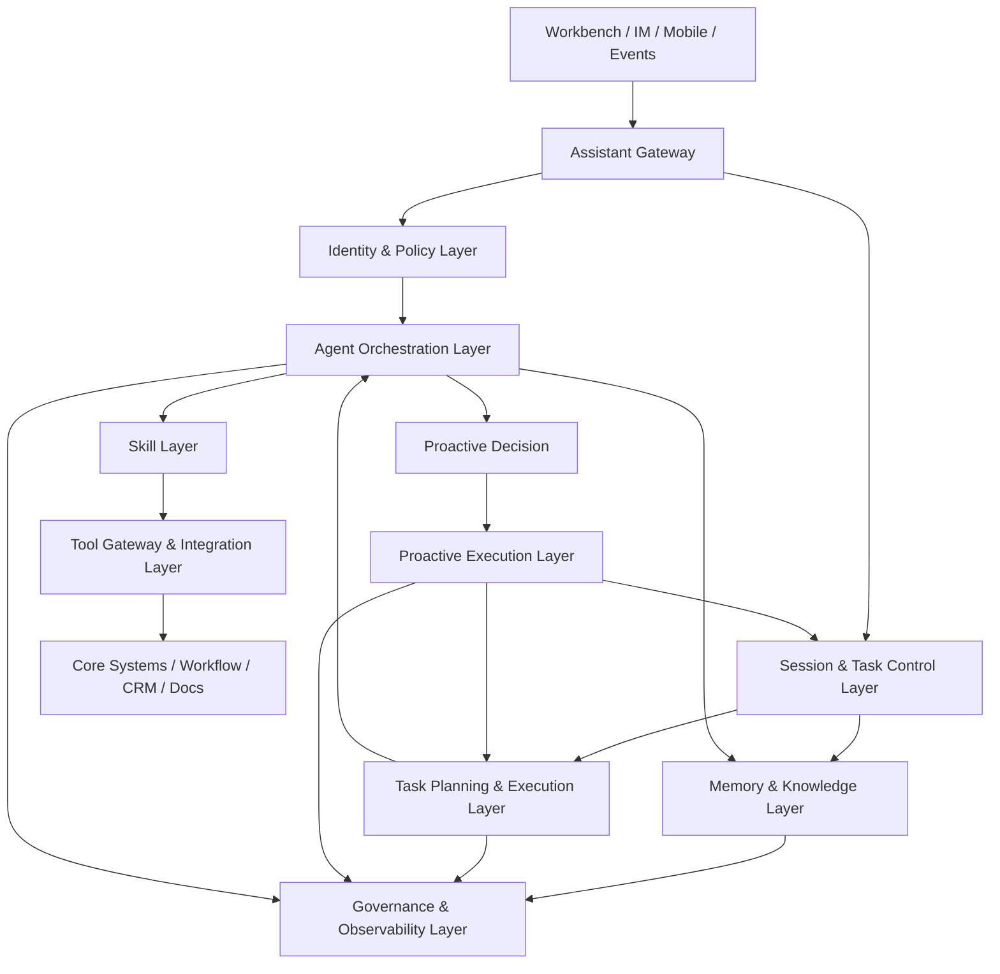
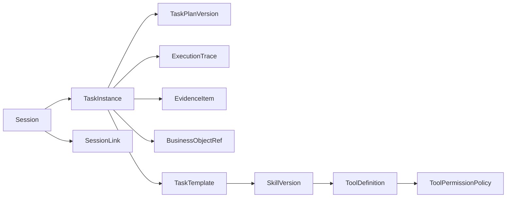
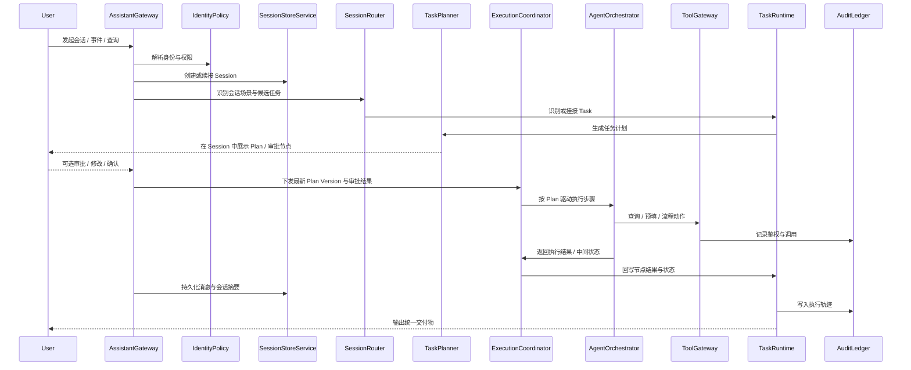
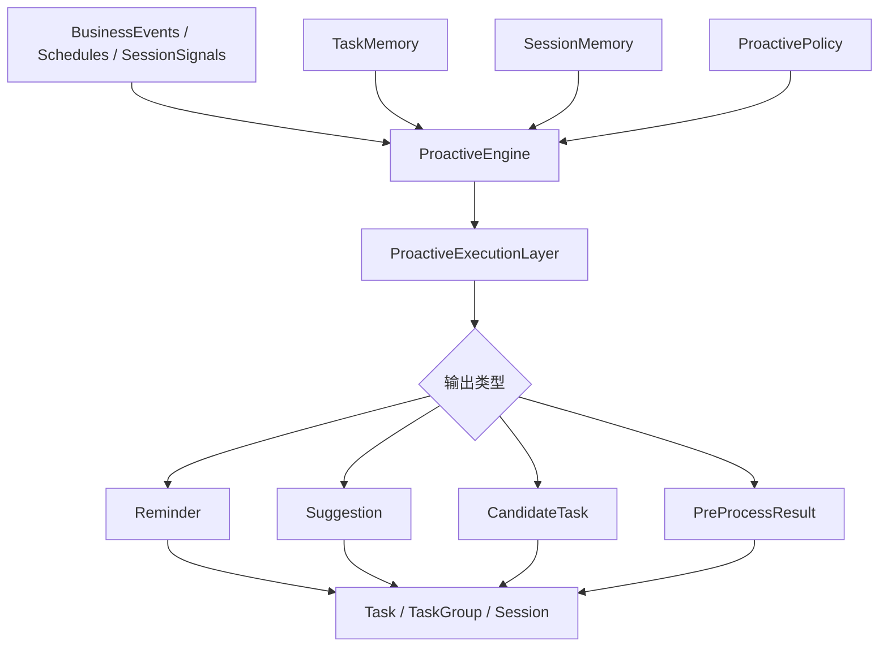

# Banking OpenClaw 技术架构方案

## 一、文档目的

本文基于以下三份文档形成银行版 OpenClaw 的正式技术架构方案：

- [PRD 草稿](./banking-openclaw-prd-draft.md)
- [OpenClaw 官方架构与技术栈补充研究](./openclaw-official-architecture-and-tech-stack.md)
- [银行版 OpenClaw 的产品架构草图](./banking-openclaw-product-architecture-sketch.md)

目标不是复刻一个个人 AI 助理，而是设计一套适合银行员工场景的 `Assistant OS`：

- 以 `Session` 为自然交互入口
- 以 `Task` 为治理、执行、审计和自动化主对象
- 以 `Tool Gateway` 为受控执行边界
- 以治理化记忆、权限分级、证据链和回放能力为基础设施
- 以 OpenClaw 的控制平面、Session/Queue、Agent Runtime、Skills、Cron 等机制作为底层启发

一句话定义：

**Banking OpenClaw = Assistant OS + Task Engine + Governed Agent Runtime + Banking Control Plane**

---

## 二、架构设计原则

### 1. Session-first

系统不能退化成纯任务系统，也不能退化成纯聊天系统。  
所有触点都应先归入 `Session`，再在 `Session` 内持续识别、挂接和推进 `Task`。

### 2. Task-first

`Task` 是系统真正的执行、治理、审计和自动化对象。  
所有主动输出、建议、预处理结果和受控执行，都必须回挂到 `Task` 或 `Task Group`。

### 3. Governance-first

权限、审计、证据链、风险阈值、计划版本、人工确认和回放，不应是后补模块，而应是系统主干。

### 4. Human-in-the-loop

默认策略应是：

- 低风险场景优先支持只读和建议
- 中风险场景要求关键节点确认
- 高风险场景要求显式审批或完全转人工

### 5. Memory-is-governed

银行版记忆必须是分层、受权限控制、可追溯、可清理、可管理生命周期的治理化记忆，而不是自由生长的个人长期记忆。

### 6. Plugin-based Design

系统应遵循插件化设计原则，使核心控制面、任务运行时和治理框架保持稳定，而把高频变化的业务能力以可插拔方式接入。

重点包括：

- 新任务定义可通过插件化 `Task Template` / `Task Definition` 扩展，而不要求改动核心运行时
- 新知识类型可通过插件化 `Knowledge Source` / `Knowledge Adapter` 接入，而不要求重写检索主链路
- 新技能可通过插件化 `Skill` 扩展，并具备版本管理、权限控制、灰度发布和回滚能力
- 新工具可通过插件化 `Tool` / `Connector Adapter` 接入，并统一纳入 `Tool Gateway` 的鉴权、审计和风险分级
- 新场景策略、主动规则和行业化能力，也应优先通过插件或注册式机制扩展，而不是把场景逻辑硬编码到核心系统

这样可以保证未来在新增岗位场景、任务类型、知识源、技能包和工具集成时，系统仍能保持可扩展、可治理、可测试和可演进。

### 7. AI 与流程系统分层

系统遵循一个核心边界：

**AI 负责理解、归纳、判断准备和执行建议，流程系统负责正式路由、状态流转和业务落地。**

---

## 三、目标架构总览

从宏观上，系统可以拆成十层：

1. 交互接入层
2. 身份与策略层
3. 会话与任务控制层
4. 任务规划与执行层
5. Agent 编排与认知层
6. 知识与记忆层
7. 技能 Skill 层
8. 主动能力执行层
9. 工具与系统集成层
10. 治理与观测层

这套架构在理念上继承 OpenClaw 的以下机制：

- `Gateway` 作为长生命周期控制平面
- `Session/Queue` 作为上下文连续性和并发控制基座
- `Agent Runtime` 作为理解、推理、工具调用和状态写回的主循环
- `Skills` 作为结构化能力封装
- `Cron/Heartbeat` 作为主动能力调度基础
- `显式记忆` 作为可治理的上下文存储原则

与此同时，它对 OpenClaw 做了银行化改造：

- 从个人信任模型升级为企业身份与 `RBAC + ABAC` 权限模型
- 从自由式 memory 升级为治理化分层记忆和执行证据链
- 从通用工具调用升级为带审批、幂等、审计和限流的 `Tool Gateway`
- 从 Session 主导升级为 `Session + Task` 双核心
- 新增治理、风控、价值度量和 FTE 分析层

---

## 四、分层架构设计

## 4.1 交互接入层

这一层解决“员工从哪里触达 Assistant”。

### 组成

- `Workbench Web App`
- `Enterprise IM Adapter`
- `Mobile Work Entry`
- `CLI Access`
- `Email / Document / Meeting Event Adapter`
- `API / WebSocket Access Layer`

### 设计要求

- 正式工作入口必须以工作台为主，而不是把聊天窗口作为唯一载体
- 辅助触点用于快速触发、查看摘要、接收提醒和轻量确认
- `CLI` 主要用于技术性测试、联调、压测、问题复现和自动化验收，不作为面向业务用户的正式主入口
- 所有入口共享同一 `Session` / `Task` 上下文
- 不允许不同入口形成彼此割裂的记忆状态

### 对 OpenClaw 的映射

- 对应 OpenClaw 的多渠道输入和 Gateway 接入能力
- 但入口从消费级消息通道改为银行工作台、企业 IM、技术测试用 CLI 和业务事件

## 4.2 身份与策略层

这一层是银行版与个人版 OpenClaw 最大的差异之一。
它不应作为本地运行时中的隐式能力存在，而应体现为一组独立的远程 API 服务，由控制平面和各执行服务按统一协议调用。

### 核心服务

- `Identity Resolver`
- `Org & Role Resolver`
- `Policy Decision Point`
- `Policy Enforcement Point`
- `Consent & Approval Service`

### 服务形态

- 以企业内网中的远程 API 服务形态部署，供 `Assistant Gateway`、`Task Runtime`、`Tool Gateway` 和治理服务统一调用
- 对外提供标准化接口，例如身份解析、岗位查询、权限判定、审批校验和授权上下文下发
- 后端优先对接银行已有的身份认证、单点登录、组织架构、岗位权限、审批流和客户域控制系统，而不是重复建设一套孤立身份权限底座
- 通过 API 网关或服务网格统一接入鉴权、限流、超时控制、审计和可观测性
- 作为共享基础能力独立演进，避免把身份和策略逻辑散落在各个 Agent 或工具实现中

### 核心职责

- 对接并聚合银行现有 IAM、AD/LDAP、SSO、组织人事、权限平台和审批系统能力
- 绑定员工 ID、岗位、组织、审批链、权限域和业务对象范围
- 依据 `RBAC + ABAC` 做细粒度判权
- 对不同动作执行分级控制：读取、生成、流程发起、自动执行
- 为高风险动作挂接确认、审批、转人工和回退机制

### 核心边界

- Assistant 不持有全局超级权限
- 任何读取和执行都必须继承当前身份、当前 `Session` 和当前 `Task` 上下文
- 判权必须以“谁、对什么对象、在什么任务中、试图做什么动作”为输入

### 对 OpenClaw 的映射

- 对应 OpenClaw 的 trust、policy、approval 和 sandbox 思路
- 但从个人设备信任升级为企业级身份治理、远程策略服务和上下文授权体系

## 4.3 会话与任务控制层

这一层负责把自然交互变成可治理的工作对象。
其中一部分能力应保留在 `Assistant Gateway` 所在的本地控制面中，负责实时接入、会话编排和运行态控制；另一部分能力应下沉为后端远程服务，负责 `Session` / `Task` 持久化、任务识别、模板管理和跨会话关联。

### 核心服务

- `Session Gateway`
- `Session Store Service`
- `Session Router`
- `Task Detector`
- `Task Template Registry`
- `Task Instance Manager`
- `Session Linker`
- `Queue / Lane Manager`

### 本地控制面能力

- `Session Gateway`：负责连接接入、请求归并、会话创建/续接、消息标准化和流式输出编排
- `Queue / Lane Manager`：负责同一 `Session` 的并发互斥、消息插入策略、运行中断和 follow-up 协调
- 轻量 `Session Runtime Cache`：缓存当前会话的短期运行态，例如最近消息、当前 run 状态、待回写结果和临时上下文

这部分能力应尽量靠近 `Assistant Gateway` 部署，优先保证低延迟、实时性和对前端/CLI/IM 入口的一致控制。

### 远程服务能力

- `Session Store Service`：作为会话主服务负责 `Session`、`SessionMessage`、`SessionContext` 的远程持久化，并将最终数据保存到远程服务器数据库
- `Session Router`：作为远程服务负责会话分类、场景路由和候选任务判断
- `Task Detector`：作为远程识别服务负责基于模板完成任务识别、补识别和重识别
- `Task Template Registry`：作为后端主数据服务管理模板定义、版本、适用岗位、风险等级和技能白名单
- `Task Instance Manager`：作为任务主服务负责 `TaskInstance`、`TaskGroup`、会话挂接关系和状态持久化
- `Session Linker`：作为关联分析服务负责跨 `Session` 的客户、案件、材料和语义关联发现

这部分能力应以后端远程 API 服务形态存在，由控制平面统一调用，并与任务规划、知识检索、审计和治理服务共享权威数据。

### 核心职责

- 统一管理 `Session` 生命周期、队列、并发和消息插入模式
- 根据模板识别 `Task`，而不是让模型自由发明任务类型
- 在高、中、低置信度下分别自动挂接、候选确认或降级澄清
- 发现跨 `Session` 的客户、案件、账户、材料和语义关联
- 支持一个 `Session` 对应多个 `Task`，也支持一个 `Task` 由多个 `Session` 延续推进

### 协作边界

- 本地控制面负责“实时接住请求并维持运行秩序”，不负责长期业务真相的最终存储
- 远程服务负责“给出权威任务结果并持久化对象状态”，不直接承接前端连接和流式会话控制
- `Session` 的接入态和运行态可以在本地短暂缓存，但最终必须通过远程 API 服务写入远程服务器数据库，不能只停留在本地控制面
- `Task`、`SessionLink`、模板版本和挂接关系应以后端服务为准
- 本地控制面在创建会话、追加消息、更新摘要、状态切换等关键时点，都应调用远程服务完成持久化，保证 `Session -> Task` 主线可审计、可恢复、可跨入口复用

### 推荐对象模型

- `Session`
- `SessionMessage`
- `SessionContext`
- `SessionLink`
- `TaskTemplate`
- `TaskInstance`
- `TaskGroup`

### 对 OpenClaw 的映射

- 对应 OpenClaw 的 `Session + Queue` 机制
- 但增加了银行场景必须的一层 `Task` 对象模型、模板约束和跨 Session 业务关联

## 4.4 任务规划与执行层

这一层负责把复杂工作从“临场判断”转成“可规划、可执行、可回放”的任务图。
与 `4.3` 类似，这一层也应区分本地控制面中的实时编排能力，以及后端远程服务中的长任务执行、计划持久化和状态管理能力。

这里的核心约束是：

- `Plan` 的生成、解释、重规划和结果汇总逻辑统一由大语言模型驱动
- 员工可以直接在 `Session` 中查看、修改建议并对 `Plan` 做审批，审批是否必需由风险策略决定
- `Plan` 的正式执行不由静态规则编排器硬编码，而是由基于大语言模型构建的 `Coordinator` 结合当前 `Plan Version`、策略和运行态来推进
- 原先可拆成 `Task Graph Runtime`、`Task State Machine`、`Task Aggregator`、`Replan Manager` 的能力，不再作为独立后端服务存在，而是由 `LLM Coordinator` 动态调度，并由专门的执行存储服务落库

### 核心服务

- `Task Planner`
- `Task Plan Store Service`
- `Task Execution Storage Service`
- `Human Takeover Controller`

### 本地控制面能力

- 轻量 `Execution Coordinator`：作为基于大语言模型构建的本地协调器，负责解释当前 `Plan Version`，并把当前会话中的用户输入、计划审批、确认动作、打断操作和前端实时反馈接入到任务执行链路
- `Human Takeover Controller` 的交互面部分：负责在本地控制面中承接确认、暂停、继续、转人工和回退指令
- 轻量 `Execution Runtime Cache`：缓存当前执行中的节点状态、待确认动作、临时中间结果和流式输出片段

这部分能力应靠近 `Assistant Gateway` 部署，主要目标是保证计划展示、人工确认、执行反馈和中断控制的实时性。

### 远程服务能力

- `Task Planner`：作为远程规划服务负责基于大语言模型从 `Session` / `Task` 上下文中生成任务计划、子任务结构、依赖关系和交付结构
- `Task Plan Store Service`：作为计划主服务负责 `TaskPlanVersion`、计划差异、确认记录和重规划版本的持久化，并将最终数据保存到远程服务器数据库
- `Task Execution Storage Service`：作为执行存储主服务负责持久化任务执行过程、节点结果、中间状态、等待事件、失败原因、重试记录、回退结果和最终交付物，并将最终数据保存到远程服务器数据库
- `Human Takeover Controller` 的服务端部分：负责记录人工接管、审批结果、回退结果和恢复执行决策

这部分能力应以后端远程 API 服务或长任务服务形态存在，由控制平面和任务主服务统一调用，并与审计、证据链、工具网关和任务数据库共享权威状态。

### 核心职责

- 从 `Session` 中抽取目标、拆解子任务、生成计划和统一交付结构
- 标注可并行步骤、前后依赖、风险等级和人工确认节点
- 允许员工直接在 `Session` 中审批、跳过、打回或接受当前 `Plan`
- 由 `LLM Coordinator` 根据最新计划版本动态调度任务节点，并处理等待、重试、回退、补件、升级人工、结果汇总和外部回执
- 通过 `Task Execution Storage Service` 统一回写执行过程、执行状态、最终交付物以及 `Session`、`Task` 和证据链关联信息
- 在执行条件变化时触发 `Replan`，并保留完整计划版本

### 协作边界

- 本地控制面负责“让用户看见并控制执行过程”，不负责保存任务计划和执行状态的最终业务真相
- 远程服务负责“生成计划、持久化计划版本、保存执行过程和最终结果”，不直接承接前端实时连接
- `LLM Coordinator` 负责动态调度与执行判断，但权威执行记录必须写入 `Task Execution Storage Service`
- 任务计划、执行状态、人工确认记录、回退记录和 `Replan` 版本最终都必须通过远程服务写入远程服务器数据库
- 本地控制面可以短暂缓存运行中的节点状态和中间结果，但这些缓存只用于实时交互优化，不能替代后端权威状态
- 每次计划生成、计划确认、节点完成、执行失败、人工接管和重规划后，本地控制面都应推动结果回写远程服务，保证任务可恢复、可审计、可跨入口续接

### 设计关键点

- 任务规划应默认存在，尤其对复杂工作场景
- `Plan` 应被视为一个可审阅、可审批、可重规划的正式对象，而不是一次性的模型中间产物
- 计划先展示、后执行，不应直接隐式发起多步动作
- `Replan` 不能覆盖原始计划，而应保留版本差异和调整原因
- 执行过程的权威真相不应保存在协调器内存中，而应沉淀到 `Task Execution Storage Service`

### 对 OpenClaw 的映射

- 对应 OpenClaw 的 Agent Loop 之后的更强任务执行抽象
- 相当于把个人助手中的多步 tool loop 升级为企业级计划对象、动态协调执行和可审计执行存储

## 4.5 Agent 编排与认知层

这一层是系统的智能运行内核。
从部署口径上看，这一层通常由靠近控制面的本地编排能力，以及后端远程认知与模型服务共同组成：本地侧负责当前会话中的编排控制和实时交互衔接，远端侧负责认知处理、模型推理、技能执行和主动决策。

### 核心服务

- `Agent Orchestrator`
- `Cognitive Engine`
- `Skill Runtime`
- `Model Gateway`
- `Prompt / Policy Composer`
- `Proactive Engine`

### 部署口径

- `Agent Orchestrator` 与 `Prompt / Policy Composer` 更适合靠近 `Assistant Gateway` 部署，用于装配当前会话上下文、控制执行节奏和衔接本地运行态
- `Cognitive Engine`、`Skill Runtime`、`Model Gateway` 和 `Proactive Engine` 更适合作为远端服务部署，用于统一承接模型推理、技能执行、策略判断和主动决策
- 本地编排能力可以短暂持有执行中的上下文和中间状态，但认知结果、模型输出、技能执行记录和主动决策结果最终仍应回写远端服务

### 核心职责

- 装配上下文：身份、会话、任务、知识、记忆、历史执行轨迹
- 执行认知处理：抽取、归纳、比对、解释、建议生成
- 根据任务阶段和动作风险选择模型、技能和工具
- 把主动能力建立在事件、调度、任务记忆和治理策略之上
- 输出结构化结果、解释、建议、候选任务和待确认动作

### 能力分层

- `Cognitive Engine` 负责“理解与判断准备”
- `Skill Runtime` 负责“岗位动作能力封装”
- `Model Gateway` 负责“多模型路由、成本和质量控制”
- `Proactive Engine` 负责“持续判断何时主动介入”

### 对 OpenClaw 的映射

- 直接承接 OpenClaw 的 `Agent Runtime / Agent Loop + Skills + Cron / Heartbeat`
- 但在银行场景中加入模型白名单、动作分级、技能版本治理和主动能力落点约束

## 4.6 知识与记忆层

这一层负责可治理的上下文连续性。
它既需要靠近控制面的本地暂存机制，用于提升实时交互和检索装配效率；也需要后端远程存储机制，用于保存权威知识、长期记忆和执行证据链。

### 核心服务

- `Enterprise Knowledge Service`
- `Memory Service`
- `Local Memory Cache`
- `Local Embedding / Index Runtime`
- `Local Retrieval Runtime`
- `Retrieval Service`
- `Evidence Store`
- `Embedding / Index Pipeline`

### 本地暂存机制

- `Local Memory Cache`：在 `Assistant Gateway` 或编排层附近缓存当前 `Session`、当前 `Task`、最近检索结果和短期运行态上下文
- 本地临时摘要缓存：保存最近一次会话摘要、任务摘要、候选知识片段和模型装配所需的临时上下文
- 本地检索结果缓存：对短时间内高频重复访问的知识片段、模板规则和记忆查询结果做只读缓存
- `Local Embedding / Index Runtime`：对与企业知识库无关的本地文件、临时上传材料，或从企业知识库下载到本地的文件副本做文档切分、向量化和轻量索引构建
- `Local Retrieval Runtime`：基于本地轻量索引对上述本地文件和数据执行混合检索、metadata filter 和结果重排，用于当前会话或当前任务的快速辅助理解

这部分机制的目标是降低实时交互延迟、减少重复检索和提升上下文装配效率。在需要处理临时文件、下载副本和非企业知识库资料时，本地也可以具备轻量索引与检索能力；但它仍只承担“暂存”“加速”和“局部辅助处理”职责，不应作为长期权威记忆来源。

### 远程存储机制

- `Enterprise Knowledge Service`：作为远程知识主服务管理制度、产品规则、案例、FAQ、模板和知识版本
- `Memory Service`：作为远程记忆主服务管理各类治理化记忆的写入、读取、生命周期和权限边界
- `Evidence Store`：作为远程证据服务保存引用材料、计划版本、人工修改记录、工具调用记录和可回放资产
- `Embedding / Index Pipeline`：作为远程索引链路负责文档切分、向量化、索引更新和检索索引维护
- `Retrieval Service`：作为远程检索服务负责混合检索、权限过滤、metadata filter 和结果重排

这部分能力应以后端远程服务和远程存储形态存在，最终将知识、记忆和证据链数据保存到远程服务器数据库、索引系统和对象存储中。

### 记忆分层

- `Identity Memory`
- `Role Memory`
- `Session Memory`
- `Task Memory`
- `Enterprise Memory`
- `Execution Trace`

### 核心职责

- 存储岗位、组织、任务、知识和执行过程中的长期上下文
- 提供基于 metadata filter 的混合检索能力
- 确保不同记忆层拥有独立的权限边界和生命周期策略
- 把证据链、人工修改、计划版本、工具调用和依据材料沉淀为可回放资产

### 协作边界

- 本地暂存机制负责“提升实时装配和读取效率”，不负责保存知识与记忆的最终业务真相
- 远程存储机制负责“保存权威知识、长期记忆和执行证据”，并作为跨入口、跨会话、跨任务共享的唯一可信来源
- `Session Memory`、`Task Memory`、`Enterprise Memory` 和 `Execution Trace` 可以在本地短暂缓存，但最终都必须通过远程服务写入远程服务器数据库或对象存储
- 本地索引与检索能力只应用于与企业知识库无关的本地材料，或从企业知识库下载到本地后用于当前任务快速处理的文件副本；凡是需要跨任务、跨会话、跨用户共享的知识与索引，仍应由远程服务统一维护
- 本地缓存中的摘要、检索命中结果和临时上下文可以失效或重建，但远程存储中的知识版本、记忆记录和证据链必须可追溯、可恢复、可审计

### 设计关键点

- 所有记忆必须显式写入，禁止“不可见隐式记忆”
- 本地允许对临时文件和下载副本做轻量索引与检索，但不允许形成绕开治理的“影子知识库”或“影子记忆”
- 所有检索必须带权限过滤和上下文过滤
- `Execution Trace` 是银行版最关键的记忆层之一

### 对 OpenClaw 的映射

- 继承 OpenClaw “只有被写入的内容才会被记住”的显式记忆原则
- 但将文件式个人记忆改造成企业级治理化分层记忆

## 4.7 技能 Skill 层

这一层位于知识与记忆层和工具层之间，负责把岗位动作能力、任务方法论和领域执行套路沉淀为可注册、可版本化、可治理、可复用的 `Skill`。
它的作用不是替代模型，也不是直接替代工具，而是把“针对某类任务应该如何组织知识、工具和步骤”封装成稳定能力单元。

### 核心服务

- `Skill Registry`
- `Skill Package Manager`
- `Skill Runtime`
- `Local Skill Cache`
- `Skill Verification & Security Checker`
- `Skill Policy Manager`
- `Skill Version Manager`

### 本地能力

- 本地可加载当前会话或当前任务所需的轻量 `Skill Manifest`、参数模板和调用配置，用于加速技能装配和技能选择
- 本地应缓存高频使用的 `Skill Package`、`Skill Manifest`、参数模板和依赖元数据，以便在当前终端或工作站上实现快速装载和快速执行
- 在技术测试、调试和本地验证场景下，可加载受控本地 `Skill Package` 或实验性技能定义，但必须限定在白名单目录和测试范围内
- 对于适合本地运行的技能，技能智能本身可以在本地执行；对于依赖远端模型、远端知识或远端算力的技能，技能智能则应由远端服务执行
- 本地加载和执行前应经过签名校验、版本校验、来源校验、权限校验和依赖完整性检查，防止未授权或被篡改的技能进入执行链路

### 远程服务能力

- `Skill Registry`：作为远程技能注册中心统一维护技能定义、技能元数据、适用任务、输入输出 schema 和依赖关系
- `Skill Package Manager`：作为远程技能包服务统一管理技能发布、安装、版本升级和回滚
- `Skill Runtime`：作为远程技能执行服务负责技能编排、参数装配、上下文注入和执行记录沉淀
- `Skill Verification & Security Checker`：作为远程校验服务统一管理技能签名、来源、完整性、依赖合法性、安全扫描和执行前校验策略
- `Skill Policy Manager`：作为远程策略服务管理技能权限、风险等级、适用岗位、灰度范围和可用工具白名单
- `Skill Version Manager`：作为远程版本服务管理技能版本、兼容性、灰度发布和版本冻结

### 核心职责

- 把岗位动作、任务套路和领域执行方法封装为标准化技能单元
- 为不同 `Task Template` 和场景动态选择、装配和调用合适的 `Skill`
- 管理技能的版本、依赖、权限、灰度、回滚和审计记录
- 让新增岗位能力、新任务方法和行业化动作可以通过技能包快速扩展，而不必改动核心运行时

### 协作边界

- 知识与记忆层提供技能执行所需的知识、上下文和证据输入，但不负责定义“如何执行”岗位动作
- 技能层负责封装“如何组合知识、模型和工具完成某类任务”，但不直接持有企业业务系统的正式执行权限
- 工具层负责提供可被技能调用的本地工具和远程工具能力，并对正式系统动作实施统一治理
- 技能定义和技能执行记录最终应由远程服务统一管理；本地技能缓存用于装配加速、快速执行、调试验证和受控测试
- 技能的智能执行位置可以是本地也可以是远程，取决于技能本身的风险等级、依赖资源、算力需求和治理要求；但无论在哪里执行，都必须遵守统一的技能策略和安全校验机制

### 设计关键点

- `Skill` 应成为一等扩展对象，与 `Task Template`、`Knowledge Source`、`Tool` 一样支持注册式扩展
- 每个 `Skill` 都应有明确的输入 schema、输出 schema、适用任务、权限标签和风险等级
- `Skill` 必须支持版本化、灰度发布、回滚、依赖声明和执行审计
- `Skill` 必须支持本地缓存后的安全运行机制，包括签名验证、完整性校验、来源校验、目录白名单和执行前策略检查
- 应根据技能类型区分“本地智能技能”和“远程智能技能”，并在注册中心中声明其执行位置、依赖资源和安全要求
- 本地实验性 `Skill` 不得绕开远端治理直接进入正式业务链路

### 对 OpenClaw 的映射

- 对应 OpenClaw 把 `Skills` 作为正式能力层而不是散落提示词的设计思路
- 但在银行场景中进一步强化为可注册、可版本化、可治理、可灰度发布的岗位技能体系

## 4.8 主动能力执行层

这一层负责把 `Proactive Engine` 产生的主动判断真正转成可执行的调度、唤醒、周期任务和受控触发动作。
它与 `4.5 Agent 编排与认知层` 的区别在于：`4.5` 负责判断“是否应该主动做点什么”，`4.8` 负责把这个判断落成实际运行中的本地或远程 `cron job`、定时扫描、事件唤醒和主动执行流程。

### 核心服务

- `Local Cron Runner`
- `Remote Cron Service`
- `Proactive Job Scheduler`
- `Proactive Wakeup Dispatcher`
- `Proactive Execution Controller`
- `Proactive Job Audit Recorder`

### 本地能力

- `Local Cron Runner`：在员工终端、受控工作站或本地沙箱环境中运行本地周期任务，可用于技术测试、本地资料巡检、下载文件复查、本地索引刷新，也可在满足治理要求时承接部分正式业务场景中的定时任务、周期巡检和批量主动扫描
- 本地定时触发机制：支持以本地 `cron job` 或等价调度方式执行轻量主动任务，例如刷新本地缓存、重扫本地任务材料、生成测试摘要或触发本地验证逻辑
- 本地主动任务执行必须受终端鉴权、目录白名单、任务白名单和策略开关控制，且所有关键执行结果都应回传远端服务留痕

### 远程服务能力

- `Remote Cron Service`：作为远端周期任务服务统一承接定时任务、周期巡检和批量主动扫描，尤其适用于需要跨用户、跨任务、跨系统集中调度的正式业务场景
- `Proactive Job Scheduler`：作为远端调度服务统一管理主动任务计划、执行频率、触发窗口、重试策略和并发限制
- `Proactive Wakeup Dispatcher`：作为远端唤醒服务根据事件、时间和策略把对应 `Session`、`Task` 或岗位工作集重新激活
- `Proactive Execution Controller`：作为远端执行控制服务负责把主动判断转成提醒、候选任务、预处理结果或受控执行动作
- `Proactive Job Audit Recorder`：作为远端审计服务记录主动任务的触发原因、执行过程、结果落点和人工处理结果

### 核心职责

- 负责承接事件触发、周期触发和会话派生触发后的主动任务执行
- 把主动判断转成可调度、可执行、可回放的任务单元
- 管理本地和远程 `cron job` 的执行边界、调度策略、失败重试和唤醒机制
- 确保主动能力输出最终回挂到 `Session`、`Task` 或 `Task Group`，而不是漂浮在任务系统之外

### 协作边界

- `Proactive Engine` 负责做主动判断和输出建议，不直接承担底层调度器和 `cron job` 执行职责
- 主动能力执行层负责“让主动判断真正跑起来”，但不替代任务规划层和工具层的正式执行治理
- 本地和远程 `cron job` 都可以承接正式业务场景中的定时任务、周期巡检和批量主动扫描，具体取决于任务本身的数据位置、执行环境、风险等级、治理要求和是否需要跨终端集中调度
- 无论本地还是远程执行，主动任务的结果、审计记录和状态变更最终都必须回写远端权威服务

### 设计关键点

- 主动能力应支持“本地调度 + 远程调度”双层机制，两者都可在满足条件时承接正式业务任务
- 本地 `cron job` 必须受目录白名单、任务白名单、终端鉴权和风险开关控制
- 远程 `cron job` 必须支持统一策略、集中审计、失败重试、幂等控制和人工兜底
- 主动能力执行层应与 `Task Runtime`、`Session Store Service`、`Tool Gateway` 和治理层打通，保证主动任务可追踪、可恢复、可干预

### 对 OpenClaw 的映射

- 对应 OpenClaw 的 `Cron / Heartbeat` 主动运行机制
- 但在银行场景中进一步强化为支持本地与远程调度、受控主动触发、统一审计和任务系统回挂的主动能力执行层

## 4.9 工具与系统集成层

这一层决定 AI 是否可以安全地连到真实业务系统。
与前面几层类似，这一层也应明确区分本地工具能力和远程工具能力：本地工具主要服务于当前终端、当前会话和技术性辅助处理；远程工具则负责正式业务系统集成、跨系统动作执行和企业级治理。

### 核心服务

- `Tool Gateway`
- `Local Tool Runtime`
- `Connector Registry`
- `Connector Adapters`
- `Workflow Bridge`
- `Idempotency Service`
- `Rate Limit & Quota Service`

### 本地工具能力

- `Local Tool Runtime`：负责执行与当前终端环境、当前会话或当前任务局部处理相关的本地工具
- 本地文件与数据处理工具：例如本地文件解析、格式转换、临时脚本处理、局部数据整理和测试辅助工具
- 本地文件读取工具：允许读取当前任务所需的本地文件、下载文件和受控目录内资料，用于技术测试、材料分析和本地辅助处理
- Web 访问工具：允许访问外部网页、在线文档或测试环境页面，用于资料获取、协议联调、技术验证和非核心业务数据补充
- 本地文件写入工具：允许在严格限制的白名单目录内写入本地文件，例如工作区、临时沙箱目录或测试输出目录，不允许任意路径写入
- 本地文件编辑工具：允许在严格限制的白名单目录内编辑本地文件，例如工作区中的受控文件和测试材料，不允许越界修改系统目录或非授权目录
- 本地开发与测试工具：例如 CLI 驱动的调试工具、压测工具、问题复现工具、协议联调工具和沙箱化实验工具
- 本地环境感知工具：例如读取当前运行态上下文、本地缓存、本地下载文件或本地临时索引的辅助工具

这部分能力主要服务于技术测试、局部资料处理和当前终端可见范围内的辅助执行。它可以提升联调效率和本地处理能力，但不应直接承接银行正式业务系统中的高风险动作。

### 远程工具能力

- `Tool Gateway`：作为远程统一工具网关，负责所有正式工具调用和系统动作的鉴权、审计、分级和路由
- `Connector Registry`：作为远程注册中心统一维护工具定义、版本、权限标签、风险等级和适用范围
- `Connector Adapters`：作为远程适配器对接 CRM、核心系统、信贷系统、工单系统、文档系统、消息系统等企业后端
- `Workflow Bridge`：作为远程流程桥负责把 AI 的建议动作转换为正式流程系统中的查询、表单预填、流程发起和状态更新
- `Idempotency Service`：作为远程幂等服务控制重复请求、重复触发和重放保护
- `Rate Limit & Quota Service`：作为远程配额服务控制调用频率、额度和系统级熔断

这部分能力应以后端远程 API 服务形态存在，并作为企业正式业务动作的唯一可信执行入口。

### 核心职责

- 作为所有正式业务工具调用和系统动作的唯一合法远程入口
- 统一做鉴权、参数校验、动作分级、审计、限流和幂等控制
- 将 AI 的建议动作转成正式业务系统中的查询、表单预填、流程发起和状态更新
- 屏蔽 CRM、核心系统、信贷系统、工单系统、文档系统等异构接口差异

### 协作边界

- 本地工具能力负责“在当前终端和当前会话内做辅助处理”，不负责正式业务系统中的权威状态变更
- 远程工具能力负责“连接企业系统并执行正式业务动作”，是跨会话、跨用户、跨系统共享的统一治理入口
- 涉及查询企业主数据、调用企业接口、发起流程、写入业务系统、修改正式状态的动作，原则上都必须通过远程 `Tool Gateway`
- 本地工具更适合处理临时文件、局部脚本、测试任务、开发联调和下载副本分析；如果本地处理结果需要进入正式业务链路，也应再通过远程服务完成登记、审计和写回
- 本地工具可以存在，但不应绕开远程工具治理形成“影子执行通道”

### 设计关键点

- Agent 不直连底层业务系统高权限账号
- 每个工具都应有明确的输入 schema、输出 schema、权限标签和风险等级
- 本地工具与远程工具都应有明确分类、能力标签和允许场景，避免混用
- 本地写文件和编辑文件能力必须绑定目录白名单、操作审计和风险限制，默认只允许工作区、沙箱目录或明确授权目录
- 高风险动作必须支持 dry-run、预览和人工确认

### 对 OpenClaw 的映射

- 对应 OpenClaw 的 tool policy、sandbox、exec approval
- 但进一步升级为企业集成层和正式业务执行桥

## 4.10 治理与观测层

这一层负责让系统可上线、可审计、可运营、可度量价值。
这一层的能力原则上都应来自远端 API 服务，而不应放在本地控制面中单独实现。原因在于治理、审计、指标、风控和经营分析都要求跨会话、跨用户、跨系统统一汇总，并以远端权威数据为准。

### 核心服务

- `Audit Ledger`
- `Risk Control Center`
- `Observability Platform`
- `Model Evaluation Service`
- `FTE & Value Analytics`

### 服务形态

- `Audit Ledger`：作为远端审计服务统一接收、存储和查询访问日志、动作日志、审批记录和执行痕迹
- `Risk Control Center`：作为远端风控策略服务统一管理模型白名单、工具白名单、技能灰度、自动化级别和策略开关
- `Observability Platform`：作为远端观测服务统一汇聚指标、日志、Trace、告警和运行健康状态
- `Model Evaluation Service`：作为远端评估服务统一沉淀模型效果、提示词/技能版本效果和质量评估结果
- `FTE & Value Analytics`：作为远端经营分析服务统一统计任务覆盖率、节省时长、替代潜力和岗位级价值贡献

这些能力都应以后端远端 API 服务形态存在，并连接远端日志平台、审计数据库、指标系统和分析仓库，形成统一治理底座。

### 核心职责

- 记录谁在何时以何权限访问了什么数据、触发了什么动作
- 管理模型白名单、工具白名单、技能版本、自动化级别和灰度策略
- 观测任务识别准确率、计划确认率、主动采纳率、错误率、人工接管率和证据链完整率
- 统计覆盖率、节省时长、替代潜力和岗位级价值贡献

### 协作边界

- 本地控制面可以展示治理结果、风控提示和观测摘要，但不应持有完整治理规则、审计台账或权威指标口径
- 所有审计日志、风控决策、观测指标、评估结果和价值分析结果，最终都必须由远端 API 服务统一写入和读取
- 如果本地产生临时日志、调试指标或运行告警，也应回传远端治理与观测服务做集中归档和统一分析
- 治理与观测层应作为跨入口、跨会话、跨任务、跨服务共享的远端公共能力，而不是某个单点运行时的局部附属模块

### 对 OpenClaw 的映射

- 对应 OpenClaw 的运行观测和风险控制思路
- 但新增银行场景必需的审计台账、策略运营中心和经营价值分析能力

---

## 五、核心服务拆分

从工程落地看，建议把系统拆成以下服务域：

### A. Control Plane 域

- `assistant-gateway`
- `queue-service`
- `event-ingestion-service`
- `local-cron-runner`
- `local-tool-runtime`
- `local-memory-cache`
- `local-embedding-index-runtime`
- `local-retrieval-runtime`

### B. Session & Task Control 域

- `session-store-service`
- `session-router-service`
- `task-detector-service`
- `task-template-service`
- `task-service`
- `session-linker-service`

### C. Identity & Policy 域

- `identity-service`
- `policy-decision-service`
- `approval-service`

### D. Task Execution 域

- `task-planner-service`
- `task-runtime-service`
- `task-plan-store-service`
- `task-aggregator-service`
- `replan-service`

### E. Intelligence 域

- `agent-orchestrator-service`
- `cognitive-service`
- `model-gateway-service`
- `proactive-decision-service`

### F. Skill 域

- `skill-registry-service`
- `skill-package-service`
- `skill-runtime-service`
- `skill-policy-service`
- `skill-version-service`

### G. Proactive Execution 域

- `remote-cron-service`
- `proactive-job-scheduler`
- `proactive-wakeup-dispatcher`
- `proactive-execution-controller`
- `proactive-job-audit-recorder`

### H. Knowledge & Memory 域

- `knowledge-service`
- `memory-service`
- `retrieval-service`
- `evidence-service`
- `embedding-index-service`

### I. Integration 域

- `tool-gateway-service`
- `workflow-bridge-service`
- `connector-adapter-*`

### J. Governance 域

- `audit-service`
- `risk-control-service`
- `evaluation-service`
- `metrics-analytics-service`

这样的拆分有三个好处：

- 可以把高频实时链路与重处理链路分开扩展
- 可以把高敏感权限和审计能力独立部署
- 可以为后续数字岗位、多场景接入和多模型治理留出边界

---

## 六、核心数据模型

建议把下面几类对象作为主数据模型：

### 1. Session 相关

- `Session`
- `SessionMessage`
- `SessionSummary`
- `SessionContext`
- `SessionLink`

### 2. Task 相关

- `TaskTemplate`
- `TaskTemplateVersion`
- `TaskInstance`
- `TaskState`
- `TaskPlanVersion`
- `TaskGraphNode`
- `TaskGraphEdge`
- `TaskGroup`

### 3. 能力相关

- `SkillDefinition`
- `SkillVersion`
- `ToolDefinition`
- `ToolPermissionPolicy`
- `ProactivePolicy`

### 4. 治理相关

- `PolicyRule`
- `ApprovalRecord`
- `AuditEvent`
- `ExecutionTrace`
- `EvidenceItem`
- `ModelDecisionLog`

### 5. 业务映射相关

- `BusinessObjectRef`
- `CustomerRef`
- `CaseRef`
- `TicketRef`
- `DocumentBundleRef`

一个推荐的数据关系主轴如下：

---

## 七、关键运行流程

## 7.1 用户发起到任务执行

关键说明：

- 计划先于执行
- `Plan` 默认在 `Session` 中可见，可按风险策略决定是否必须审批
- 正式执行由 `LLM Coordinator` 基于最新 `Plan Version` 驱动，而不是由静态前端流程直接串联
- 工具调用必须通过 `Tool Gateway`
- `Session` 的创建、续接、消息追加和摘要更新必须通过远程 `Session Store Service` 持久化
- `Task` 状态写回必须进入 `Task Runtime`
- 审计记录必须覆盖读取、建议和执行动作

## 7.2 执行中重规划

触发条件包括：

- 新材料进入
- 关键前置条件失败
- 用户改变目标
- 任务状态变化
- 系统识别到更优路径

执行逻辑应为：

1. `Task Runtime` 发现触发条件
2. `Task Planner` 在 `LLM Coordinator` 提供的最新执行上下文基础上生成新的计划版本
3. 系统展示新旧计划差异
4. 若风险级别上升，则要求重新确认
5. 新计划生效后继续执行，但原始计划和差异必须保留

## 7.3 主动能力闭环

主动能力不是一个脱离任务系统的通知系统，而是任务系统内部的持续判断机制。

主动能力应至少支持三类触发：

- 事件触发
- 周期 / 定时触发
- 会话派生触发

执行层面应支持：

- 本地 `cron job`：可用于技术测试、本地资料巡检、本地缓存刷新，也可在满足治理要求时承接部分正式业务场景中的周期任务和主动扫描
- 远程 `cron job`：可用于正式业务场景中的周期巡检、批量扫描、集中调度和跨任务主动激活，也适用于需要统一调度和集中治理的主动任务

默认输出应以提醒、建议、候选任务和预处理结果为主。  
只有在低风险、规则清晰、权限允许时，才允许进入受控自动执行。

---

## 八、治理与安全设计

## 8.1 权限分级

建议把权限分成四类：

1. `Read`
2. `Generate`
3. `ProcessInitiate`
4. `AutoExecute`

每类权限都需要同时绑定：

- 用户工作身份
- 任务模板
- 业务对象范围
- 数据域
- 风险等级

## 8.2 审计要求

每次关键动作都应记录：

- 谁发起
- 基于什么身份和权限
- 访问了哪些数据
- 调用了哪些模型、技能和工具
- 输出基于哪些规则和证据
- 是否有人修改、确认、驳回或接管

## 8.3 风险控制要求

- 所有自动化能力默认关闭，按模板和部门灰度开启
- 高风险动作必须可预览、可确认、可回退
- 模型、技能和工具都需要版本化和灰度能力
- 对高敏感数据输出进行脱敏和出域控制
- 周期性主动能力必须有噪音控制策略，避免产生消息污染

## 8.4 证据链要求

对外输出和对内执行都应能够追溯到：

- 原始数据来源
- 命中的制度或规则
- 使用的任务模板和技能版本
- 工具调用记录
- 人工干预记录
- 最终结果版本

---

## 九、推荐技术选型

## 9.1 前端与交互层

- `React + TypeScript`
- 银行工作台嵌入式微前端或独立前端应用
- WebSocket 用于流式输出、状态更新和任务运行态同步

## 9.2 控制平面与核心服务

推荐两种模式：

### 模式 A：TypeScript 优先

- `Node.js + TypeScript`
- 适合较多复用 OpenClaw 的运行时思路
- 适合实时控制面、WebSocket、BFF 和 Agent Orchestrator

### 模式 B：混合架构

- `Gateway / Orchestrator / Agentic Workflow / Realtime BFF` 使用 `Node.js + TypeScript`
- `Session / Task 持久化 APIs / Policy / Audit / Governance APIs` 使用 `Java / Spring Boot`
- 更适合银行已有 Java 中台和治理体系较强的环境

对于大多数银行项目，推荐采用模式 B。

## 9.3 任务编排与异步运行

- 优先采用 `AI Agentic Workflow` 作为任务编排与异步运行的实现方式，由 Agent 在工作流中完成规划、执行、等待、重试、重规划、人工确认和恢复续跑
- 这类 `AI Agentic Workflow` 可以基于 `Opencode SDK`、`ClaudeCode SDK` 等 Agent SDK 实现，把多步推理、工具调用、状态推进和异步等待组织成可持续运行的任务流
- 设计上应支持以下能力：长任务运行、事件驱动唤醒、人工确认节点、失败重试、补偿回退、`Replan`、执行续跑和可审计状态持久化

## 9.4 数据存储

- `Local Files / Local Workspace Store`：参考 OpenClaw 的 local-first 思路，在受控本地工作目录或沙箱目录中保存运行时文件、下载副本、临时知识资产、本地任务产物和本地索引输入
- `SQLite` 或等价本地嵌入式存储：用于本地缓存、轻量元数据、本地检索索引、本地任务运行态快照和本地工具运行结果暂存
- `PostgreSQL`：Session、Task、Plan、Policy、SkillVersion、Audit 元数据
- `Object Storage`：附件、文档、模型产物、证据材料
- `OpenSearch / Elasticsearch`：全文检索、审计检索、运营查询
- `pgvector` 或 `Milvus`：向量索引
- `Redis`：幂等键、热点缓存、短期上下文缓存、队列状态

补充原则：

- 银行版应同时具备“受控本地存储 + 远端权威存储”双层机制
- 本地存储主要用于运行时加速、临时文件、本地下载副本、本地索引和短期恢复，不替代远端数据库、对象存储和统一索引系统
- 凡是需要跨会话、跨任务、跨用户共享的 `Session`、`Task`、审计、证据链和企业知识数据，最终都必须以后端远端存储为准
- 本地存储目录必须受白名单和审计约束，优先限定在工作区、沙箱目录或明确授权的本地数据目录

## 9.5 模型与检索

- `Model Gateway` 统一管理内部模型、专有模型和外部合规模型
- 支持模型路由、A/B、回退、成本控制和质量评估
- 检索采用 `keyword + vector + metadata filter` 混合模式
- 对敏感数据先做权限过滤，再做召回和重排

## 9.6 可观测性

- `OpenTelemetry`
- `Prometheus + Grafana`
- 企业日志平台 / `SIEM`
- 模型质量评估和提示词 / 技能版本效果追踪

---

## 十、部署建议

建议采用银行内网或专有云中的分区部署：

### 1. Local Runtime / Workspace 区

- 部署在员工终端、受控工作站或本地沙箱环境中
- 承载 `Assistant Gateway` 本地控制面能力、CLI、本地工具运行时、本地文件处理、本地轻量索引与检索、本地缓存、受控本地存储和本地 `cron job`
- 主要负责实时交互接入、短期运行态保持、临时文件处理、本地资料分析和技术性测试能力
- 本地区域只保存受控本地数据和短期运行态，不替代远端权威服务与远端数据库

### 2. Channel / BFF 区

- 面向工作台、IM、移动端和事件入口
- 承接实时连接和前端交互

### 3. Runtime 区

- 运行 Agent 编排、任务规划、技能执行、远程 `cron job` 和主动能力执行控制
- 需要弹性扩缩容

### 4. Data & Retrieval 区

- 承接结构化数据、知识索引、向量检索和对象存储
- 对高敏感数据实施单独网络和访问控制

### 5. Governance & Audit 区

- 独立部署审计、策略、风险控制和经营分析能力
- 保证审计台账与执行链路隔离存储

### 6. Integration 区

- 作为到 CRM、核心系统、流程引擎和文档系统的统一集成出口
- 禁止 Agent 直接跨越该区访问底层系统

推荐的部署原则：

- 模型调用统一从 `Model Gateway` 出口走
- 工具调用统一从 `Tool Gateway` 出口走
- 本地服务部署必须绑定工作区/沙箱目录白名单、终端鉴权和本地审计回传机制
- 本地运行态和本地存储应优先用于加速、临时处理和技术测试，权威状态最终仍以后端远端服务为准
- 审计日志优先写入不可篡改或准不可篡改存储
- 高风险策略和自动化开关必须可热切换

---

## 十一、分阶段落地路径

## 阶段一：MVP

目标是先形成“可用、可嵌入、可治理”的最小闭环。

### 范围

- `Workbench + Session Workspace + Task Runtime`
- `Task Template Registry`
- `Session Router + Task Detector`
- `Task Planner`
- `Tool Gateway`
- `Audit Ledger`
- 2 到 3 个高频场景技能

### 建议场景

- 材料预审
- 运营工单处理
- 标准客服辅助

## 阶段二：Agent-native

目标是让系统从辅助工具升级为可持续运行的工作代理底座。

### 范围

- `LLM Coordinator` 驱动的动态执行
- `Task Execution Storage Service`
- `Skill Versioning`
- `Execution Trace Replay`
- `Proactive Engine`
- 跨 `Session` 关联
- 长尾任务缓冲与晋升机制

## 阶段三：Digital Role

目标是在边界清晰的任务上形成稳定机器产能。

### 范围

- 阈值内自动执行
- 异常升级与人工兜底
- `Task Group` 级排序和批量主动能力
- 岗位级吞吐、覆盖率、错误率和 FTE 价值测算

---

## 十二、实施优先级建议

如果从真实项目推进顺序看，建议优先做以下四件事：

1. 先打通 `Session -> Task -> Tool Gateway -> Audit` 最短闭环
2. 先定义 10 到 20 个高价值 `Task Template`
3. 先把 `Execution Trace` 做成一等对象，而不是事后补日志
4. 先把主动能力限定在提醒、建议和候选任务，不急于做高自治执行

---

## 十三、结论

Banking OpenClaw 不应被理解为“给银行做一个更强聊天机器人”，而应被理解为：

**在银行正式工作触点之上，构建一个以 `Session` 为入口、以 `Task` 为主轴、以 `Tool Gateway` 为执行边界、以治理化记忆和证据链为基础设施、并能逐步演进为数字岗位的 Assistant OS。**

它真正复用 OpenClaw 的，不是消费级消息入口和个人助理设定，而是更底层的五个架构判断：

- 控制平面比聊天窗口更重要
- Session 比单轮问答更重要
- Agent Runtime 比单次模型调用更重要
- 显式记忆比隐式记忆更重要
- 主动调度能力是系统结构，而不是体验包装

而它真正增加的，是银行场景不可绕过的五个系统支柱：

- 任务对象模型
- 企业身份与上下文授权
- Tool Gateway 与正式流程桥接
- 执行证据链与回放
- 治理、风控与价值度量体系
